## Abstract

SkillSwap is a mobile application developed to enhance peer-to-peer information and skill sharing between individuals seeking to exchange what they know and learn what they do not. Platforms that claim to offer such activities, from general-purpose social communities to traditional tutoring marketplaces following a student-instructor model, fail to create a comfortable learning environment characterized by streamlined educational tools, such as real-time group collaboration, session management, and AI-assisted learning. SkillSwap capitalizes on these gaps by presenting a new approach in the landscape of informal education.

To build the application, React Native (Expo) and Node.js/Express were used for the frontend and backend respectively. Communication and data flow was established through a RESTful API and a WebSocket layer powered by Socket.IO, with a PostgreSQL database for data storage on Supabase.

SkillSwap at its core can be described as a media for online collaboration where interested users are empowered to handle two distinct roles, teacher and learner. Through forming connections with like-minded individuals, people can enlarge their social network and expand their skillset in a platform rich with tools modern learners require, such as dedicated chats, constant reminders, and powerful support systems.

Among the prominent features of SkillSwap is its AI-powered Question and Answer system, which employs Retrieval-Augmented Generation (RAG). User inquiries are satisfied after a rigorous process of data handling, starting by transforming teacher uploaded session artifacts, such as PDF and Word files, into text chunks, which are later stored as vector embeddings in the database. Following this technique, whenever a question is submitted, the system gathers the most semantically relevant chunks via vector similarity search and feeds it to a large language model hosted by Groq, providing accurate and precise information based on concrete course materials.

The system was successfully tested across all major subsystems, including user authentication, skill and group management, real-time chat with poll support, session lifecycle management, file artifact handling, and the full RAG pipeline. Key challenges encountered during development included managing role-based access control consistently across the API, designing the notification system to support bulk delivery to group members, and integrating the embedding pipeline without blocking the main request cycle. All challenges were resolved and are documented in detail throughout this report.

## Table of Contents

1. Introduction
   - 1.1 Background and Domain Context
   - 1.2 Motivation
   - 1.3 Scope
   - 1.4 Report Roadmap

2. Project Objectives and Existing Solutions
   - 2.1 Project Objectives
   - 2.2 Functional Requirements
   - 2.3 Non-Functional Requirements
   - 2.4 Use Case Overview
   - 2.5 Existing Solutions

3. System Architecture and Backend Design
   - 3.1 Purpose of the Subsystem
   - 3.2 Design Choices and Alternatives Considered
   - 3.3 Architectural Overview Diagram
   - 3.4 Backend Layer Breakdown
   - 3.5 API Design and Route Organization
   - 3.6 Authentication and Middleware
   - 3.7 Key Code Excerpts
   - 3.8 Testing and Validation

4. Database Design
   - 4.1 Purpose of the Subsystem
   - 4.2 Design Choices and Normalization
   - 4.3 Entity-Relationship Diagram
   - 4.4 Table-by-Table Schema Description
   - 4.5 Indexing and Query Strategy
   - 4.6 Security and Access Control
   - 4.7 Testing and Validation

5. Frontend Design and User Experience
   - 5.1 Purpose of the Subsystem
   - 5.2 Design Choices and Alternatives Considered
   - 5.3 Design System
   - 5.4 Navigation Architecture Diagram
   - 5.5 Component Architecture
   - 5.6 State Management
   - 5.7 API Integration Layer
   - 5.8 Role-Based UI Rendering
   - 5.9 Key Screens Walkthrough
   - 5.10 Testing and Validation

6. Real-Time Features: Socket.IO and Notifications
   - 6.1 Purpose of the Subsystem
   - 6.2 Design Choices and Alternatives Considered
   - 6.3 Socket Architecture Diagram
   - 6.4 Socket.IO Server Initialization
   - 6.5 Notification System Design
   - 6.6 Real-Time Chat Architecture
   - 6.7 Socket Connection Lifecycle on the Mobile Client
   - 6.8 Key Code Excerpts
   - 6.9 Testing and Validation

7. AI Component: RAG-Based Q&A System
   - 7.1 Purpose of the Subsystem
   - 7.2 Design Choices and Alternatives Considered
   - 7.3 RAG Pipeline Diagram
   - 7.4 Artifact Ingestion and Embedding
   - 7.5 Query Processing and Answer Generation
   - 7.6 Integration with the Backend
   - 7.7 Failure Modes and Limitations
   - 7.8 Testing and Evaluation

8. Conclusion and Future Work
   - 8.1 Summary of What Was Built
   - 8.2 Results and Reflection
   - 8.3 Challenges and Lessons Learned
   - 8.4 Limitations
   - 8.5 Future Work

References

Appendices

# Chapter 1: Introduction

## 1.1 Background and Domain Context

One of the main drives behind the digital age is expanding access to knowledge for people, regardless of their living circumstances. Throughout the exponential development of technology that is from the period of early online forums to modern comprehensive course platforms, it has always attempted to lower the barrier between those who possess a skill or an expertise in a certain field and those who whish to acquire one. However, against this massive movement, a structural weakness arises when considering how formal educational tools tend to impede the process of information sharing because of its rigid, asynchronous, and impersonal aspects. On the other hand, informal social platforms do exist in response to the increasing demand for making skill mastery more entertaining and personal, but they lack the organization, accountability, and structured progression essential for meaningful skill development.

The practice of individuals, who share at least one commonality whether it be belonging in the same age group, having the same mental state, or any other bond, teaching and learning from one another rather than a fixed instructor-student method, has long been recognized in educational research as a highly effective modality. Studies in cooperative learning theory, such as the notable work of Johnson and Johson (1989) on collaborative learning structures, show that not only does teaching a skill strengthen a peer's own abilities, but it also renders the learner more capable of grasping the explanation or core material when compared to learning from a textbook or a lecture. On another level, the trust, shared experience, and mutual accountability spurred out of this exchange is difficult to replicate in purely transactional learning environments.

Mobile computing has further shifted the landscape. As smartphones have infiltrated in every sector of the economy and due to its high rate of global usage and demand, bulding a mobile-first application is no longer a design luxury but a baseline expectation. Learners expect to access content, communicate with peers, and track their progress from the same device they use for everything else. This expectation places mobile application development at the center of any serious attempt to build a peer-to-peer learning platform with broad reach.

Within this context, the domain of skill-sharing applications sits at the intersection of social networking, educational technology (EdTech), and collaborative software. A platform in this space must simultaneously solve problems that belong to each of these fields: identity and trust (social networking), content organization and progression (EdTech), and coordination and communication (collaborative software). No single existing solution addresses all three in a cohesive, mobile-first package, and this gap forms the foundational motivation for SkillSwap.

## 1.2 Motivation

The formation of the core concept behind SkillSwap arose from a straightforward observation: people in general and friend groups in particular possess skills that others would pay or trade in order to acquire. However, the facilities to accomplish such an exchange in an interactive, accountable, and non-formal but organized way does not exist at the individual or small-group level without significant friction and overhead.

Existing platforms serve parts of this need. Tutoring marketplaces such as Preply or Wyzant connect students with paid tutors, but they are transactional rather than reciprocal, the teacher is always a professional, the learner always a customer. There is no mechanism for a learner in one domain to become a teacher in another within the same platform. Video-based platforms such as YouTube or Skillshare provide enormous breadth of content, but they are passive and asynchronous: there is no session scheduling, no group cohesion, no real-time Q&A grounded in the specific materials a teacher has prepared. General-purpose social platforms such as WhatsApp or Discord can host informal study groups, but they provide no structure, no role enforcement, no session artifacts, and no AI assistance.

SkillSwap was conceived to fill this gap. The motivating vision was a platform where a person who speaks for instance intermediate Spanish, could form a group, schedule sessions, upload vocabulary notes and grammar exercises as artifacts, and task an AI assistant with the demanding responsibility of answering learner questions specifically based on those uploaded materials. All of this could be realized while the person has simultaneously enrolled as a learner in a guitar group for instance, run by someone else. The reciprocity of roles, the structure of sessions, the grounding of AI responses in real course content, and the real-time communication layer together define a product that no existing solution currently provides.

From a technical standpoint, the project also presented a meaningful engineering challenge: building a production-grade mobile application that integrates a REST API, WebSocket communication, file storage, and a Retrieval-Augmented Generation (RAG) pipeline, all within a single cohesive system deployed and accessible at any time.

## 1.3 Scope

SkillSwap encompasses the following within its scope:

- **User management:** Registration, login, password reset via email, and a multi-step profile completion flow in which users declare the skills they wish to teach and the skills they wish to learn.
- **Skill management:** A pre-populated catalogue of default skills and the ability for users to create custom skills. Each skill has properties such as name and icon. Skills are associated with users through a join table that records the user's role (teacher or learner) and their self-assessed proficiency level on a scale of one to five.
- **Group management:** Teachers can create skill-based groups with configurable visibility, difficulty level, and a maximum participant cap. Learners can search for and request to join public groups. Teachers can invite friends with interest directly. A join-request approval workflow gives teachers control over group membership.
- **Session management:** Teachers can schedule sessions within their groups, specifying type (meeting, review, practice, or problem-solving), date, start time, end time, and any number of file artifacts. Learners can check in to sessions to record attendance. Teachers can mark sessions as completed or cancelled.
- **Real-time chat:** Each group has a persistent chat room accessible to all members. The teacher can pin messages, create polls (with configurable single or multiple-answer modes), and send broadcast notifications to all group members. Messages can be replied to with a quoted preview.
- **AI-powered Q&A:** Learners within a group can ask questions through a dedicated Q&A panel. The system in turn finds the most relevant chunks of data extracted from the uploaded artifacts, and feeds it to the AI, ensuring answers are grounded in the specific course materials.
- **Social features:** Friend requests, friend acceptance and rejection, a user search function with recent search history, and public profile pages displaying skills, mutual friends, and friendship status.
- **Notification system:** Real-time in-app notifications for friend requests, group join requests, group invitations, session creation, and session cancellation,delivered via WebSocket to online users and stored persistently for offline users.

The following are explicitly **out of scope** for the current version:

- Video or audio calling between users.
- In application support for homework assignments.
- Review system to hanlde participant suggestions or general comments on the performance of the one teaching the skill.
- Creation of hieararchy within groups (membership - admin).

## 1.4 Report Roadmap

The remainder of this report is organized as follows.

**Chapter 2** formally states the project objectives, lists the functional and non-functional requirements, presents a use case overview, and concludes with a review of existing solutions that situates SkillSwap within the landscape of prior work and justifies the need for the system.

**Chapter 3** describes the overall system architecture and the backend design, covering the layered Express.js server structure, the organization of routes, controllers, services, and utilities, the authentication and middleware strategy, and the key engineering decisions made during API design.

**Chapter 4** is dedicated entirely to the database. It presents the full entity-relationship model, walks through every table in the schema, justifies the normalization decisions, describes the indexing strategy, and addresses data security considerations.

**Chapter 5** covers the frontend design and user experience, describing the React Native component architecture, the navigation hierarchy, the design system (colors, typography, spacing), the state management approach using the Context API, and a detailed walkthrough of the key screens and the challenges encountered in building them.

**Chapter 6** examines the real-time subsystem, covering the Socket.IO architecture, the notification delivery pipeline for both online and offline users, the real-time chat system, and the integration of the WebSocket layer with the REST API.

**Chapter 7** is dedicated to the AI component. It documents the design and implementation of the Retrieval-Augmented Generation pipeline, from artifact ingestion and text extraction through chunk generation, embedding, vector storage, similarity search, and final answer generation via the Groq API.

**Chapter 8** concludes the report with a summary of what was built, an honest reflection on which objectives were met, the challenges and lessons learned, the limitations of the current system, and concrete proposals for future work.

# Chapter 2: Project Objectives and Existing Solutions

## 2.1 Project Objectives

SkillSwap was designed around a core set of objectives that guided every technical and design decision throughout development. These objectives are stated below in order of architectural priority.

**Objective 1 - Reciprocal Role System.**
Build a platform in which a single registered user can simultaneously hold the role of teacher in one or more skills and the role of learner in one or more other skills. The system must enforce role-appropriate permissions throughout, a learner in a group cannot create sessions, pin messages, or approve join requests; a teacher cannot vote in their own polls or use the Q&A assistant in the groups they run.

**Objective 2 - Structured Group and Session Lifecycle.**
Provide teachers with the tools to create skill-based groups, control membership through an approval workflow, schedule sessions with typed metadata (session type, date, time range), and attach file artifacts (PDF, Word) to sessions. The system must track session attendance per participant.

**Objective 3 - Real-Time Communication.**
Implement a persistent group chat with real-time message delivery, reply threading, message pinning, poll creation and voting, and broadcast notifications, all synchronized across connected clients via WebSocket without requiring page refresh or manual polling.

**Objective 4 - AI-Assisted Learning Grounded in Course Materials.**
Deploy an AI Q&A system that answers learner questions exclusively based on the content of the artifacts uploaded by the teacher to that group's sessions. The AI must not hallucinate answers from general knowledge when the relevant information is absent from the course materials; it must instead explicitly acknowledge the gap.

**Objective 5 - Social Discovery Layer.**
Enable users to find other users by name, view public profiles including skill portfolios and mutual friends, send and manage friend requests, and leverage their friend network when populating new groups.

## 2.2 Functional Requirements

The functional requirements below are organized by domain area.

### Authentication and User Management

- FR-1: The system shall allow a new user to register with a full name, email address, and password. The password shall be hashed before storage using bcrypt with a salt factor of ten.
- FR-2: The system shall allow a registered user to log in with their email and password and receive a signed JSON Web Token (JWT) valid for seven days.
- FR-3: The system shall support a password reset flow in which a time-limited (one hour) reset token is emailed to the user, who can use it to set a new password via a dedicated screen in the mobile application.
- FR-4: After registration, the system shall require the user to complete their profile before accessing the main application. Profile completion shall collect necessary data related to the individual and domains of interest.
- FR-5: The system shall allow a user to update their profile information at any time after profile completion.

### Skills

- FR-6: The system shall provide a pre-populated catalogue of default skills with associated icons.
- FR-7: The system shall allow any user to create a custom skill by providing a name and selecting an icon from a searchable icon library.
- FR-8: The system shall allow a user to add any skill (default or custom) to their profile with a specific role and proficiency level.
- FR-9: The system shall allow a user to mark any of their skills as a favourite.

### Groups

- FR-10: The system shall allow a teacher to create a group associated with one of their teaching skills.
- FR-11: The system shall allow a learner to browse and request to join public groups that are compatible with their proficiency level for that skill.
- FR-12: The system shall allow a teacher to approve or reject join requests from learners.
- FR-13: The system shall allow a teacher to invite friends who have the relevant skill as a learner and whose proficiency is compatible with the group difficulty.
- FR-15: The system shall allow a teacher to update group details or delete the group. Deletion shall cascade to all associated members, sessions, artifacts, and chat records.

### Sessions

- FR-16: The system shall allow a teacher to create a session within their group, by specifying details and optionally uploading artifacts.
- FR-17: The system shall automatically enroll all current group members as session participants at the time of session creation, with an initial attendance status of absent.
- FR-18: The system shall allow a learner to check in to a session, changing their attendance status to present.
- FR-19: The system shall allow a teacher to mark a session as completed or cancelled.
- FR-20: The system shall allow artifacts to be added to an existing session after creation.

### Chat and Notifications

- FR-21: The system shall provide each group with a persistent chat room accessible to all members.
- FR-22: The system shall deliver new messages in real time to all connected members of the chat room via WebSocket.
- FR-23: The system shall allow any member to reply to a message with a quoted preview of the original.
- FR-24: The system shall allow the teacher to pin and unpin messages.
- FR-25: The system shall allow the teacher to create polls with between two and ten options, configurable for single or multiple-answer responses. Polls shall be visible as inline messages in the chat.
- FR-26: The system shall deliver in-app notifications for the following events: friend request sent, friend request accepted, group join request received, join request approved, group invitation received, session created, and session cancelled.

### AI Q&A

- FR-27: The system shall allow a learner (not a teacher) to ask questions in a persistent conversation within their group's Q&A panel.
- FR-28: The system shall ground its response on the most semantically relevant chunks of text from uploaded artifacts.
- FR-29: The AI shall explicitly state when the requested information is not present in the course materials rather than generating an answer from general knowledge.
- FR-30: The system shall persist the conversation history per user per group, allowing the learner to review previous Q&A exchanges and clear the history if desired.

### Social Features

- FR-31: The system shall allow a user to search for other users by full name or nickname.
- FR-32: The system shall maintain a recent search history for each user.
- FR-33: The system shall allow a user to send, accept, and reject friend requests, subject to the target user's privacy settings.
- FR-34: The system shall display a public profile for each user showing their biography, skill portfolio (if not hidden), friend count, and mutual friends.

## 2.3 Non-Functional Requirements

**NFR-1 - Security.**
All passwords shall be stored as bcrypt hashes. All API routes (except registration, login, and password reset) shall require a valid JWT. File uploads shall be validated by MIME type and extension before storage. Supabase storage buckets shall enforce row-level security policies to prevent unauthorized access.

**NFR-2 - Performance.**
The AI Q&A pipeline shall use vector similarity search rather than full-text scan to retrieve relevant context, ensuring that response latency remains acceptable even as the number of uploaded artifacts grows. The embedding model (all-MiniLM-L6-v2) is loaded once at server startup and cached in memory for all subsequent requests.

**NFR-3 - Scalability.**
The separation of concerns between routes, controllers, services, and utilities in the backend architecture ensures that individual subsystems can be refactored or scaled independently. The use of Supabase as the database provider provides a managed PostgreSQL instance with connection pooling and storage bucket infrastructure.

**NFR-5 - Usability.**
The mobile application shall follow a consistent design system (defined color palette, typography scale, and spacing constants) across all screens. All forms shall provide inline validation with descriptive error messages. All asynchronous operations shall display loading indicators.

**NFR-6 - Maintainability.**
The frontend shall use TypeScript throughout, with typed navigation params, API response interfaces, and context values. The backend shall use a layered architecture (routes → controllers → services → utilities) with no business logic in controllers. All environment-specific configuration shall be externalized to `.env` files.

**NFR-7 - File Handling.**
The system shall accept file uploads of up to 10 MB per file for session artifacts and up to 5 MB for profile and cover images. Accepted artifact types shall include PDF, Word, Excel, PowerPoint, and plain text.

## 2.4 Use Case Overview

The primary actors in the SkillSwap system are:

- **Unauthenticated User** - a visitor who has not yet logged in.
- **Authenticated User** - a registered user who has completed their profile.
- **Teacher** - an authenticated user acting in the teacher role within a specific group.
- **Learner** - an authenticated user acting in the learner role within a specific group.
- **System** - automated processes triggered by user actions (e.g., notification
  delivery, embedding generation).

The use case diagram below (Figure 2.1) captures the primary interactions between these actors and the system.

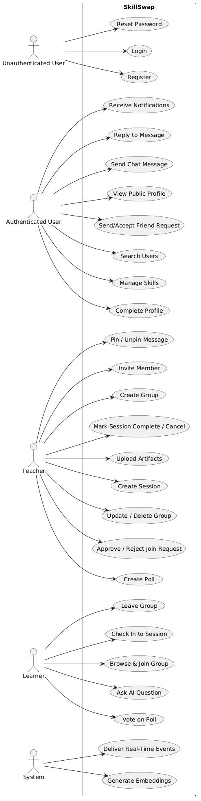
**Figure 2.1** - Use Case Diagram for SkillSwap

As illustrated in Figure 2.1, the system's use cases are organized around four primary actor categories. The unauthenticated user interacts only with the entry-point flows: registration, login, and password reset. Once authenticated and after profile completion, a user gains access to the social layer: skill management, user search, friend requests, and public profile viewing.

The teacher and learner roles are not account types but contextual roles: the same authenticated user may act as a teacher in one group while simultaneously acting as a learner in another. Within the teacher role, the user gains exclusive access to group creation, member management, session scheduling, artifact upload, message pinning, and poll creation. The learner role grants access to group discovery and joining, session check-in, poll voting, and the AI Q&A panel. Both roles share access to chat messaging and reply functionality.

Two system actors represent automated background processes. The first is the embedding generation process, which is triggered whenever a new artifact is uploaded and asynchronously processes the file into vector chunks stored in the database. The second is the real-time event delivery process, which represents the Socket.IO server that dispatches notifications and chat messages to connected clients.

## 2.5 Existing Solutions

A thorough review of existing platforms reveals that no current solution fully addresses the combination of requirements that define SkillSwap. The following analysis examines the most relevant prior work across four categories: tutoring marketplaces, video-based learning platforms, social learning tools, and AI-enhanced education tools.

### 2.5.1 Tutoring Marketplaces - Preply and Wyzant

Preply and Wyzant represent the dominant commercial model in the peer tutoring space. Both platforms connect learners with individual tutors, support session scheduling, and handle payments. Preply additionally provides an integrated video calling interface within its platform.

**Strengths:** High-quality tutor vetting, payment infrastructure, session recording on some plans, and a wide subject catalogue.

**Limitations:** Both platforms are inherently asymmetric, as the tutor is always a paid professional, and the learner always a paying customer. There is no mechanism for a user to occupy both roles simultaneously within the same platform. Groups and cohort-based learning are absent; every session is one-on-one. Neither platform integrates an AI assistant that operates on the specific materials a tutor has prepared.

### 2.5.2 Video-Based Learning - Skillshare and YouTube

Skillshare and YouTube represent the asynchronous video-based learning paradigm. Skillshare organizes content into structured courses with project-based assignments. YouTube provides open-access video content of enormous breadth.

**Strengths:** Massive content library, self-paced learning, global accessibility, and low barrier to content creation.

**Limitations:** Both platforms are fundamentally passive and asynchronous. There is no group formation, no session scheduling, no real-time communication between teacher and learner, and no mechanism to ask questions that are answered with reference to specific course materials.

### 2.5.3 Communication and Collaboration Tools - Discord and WhatsApp

Discord (discord.com) and WhatsApp are general-purpose communication platforms that are frequently repurposed for informal study groups. Discord in particular has gained traction as a community platform for online learning communities, supporting voice channels, text channels, and file sharing.

**Strengths:** Rich real-time communication, file sharing, community building, and broad device support.

**Limitations:** Neither platform is designed for structured learning. There is no concept of roles (teacher vs. learner), session scheduling, attendance tracking, proficiency-based group filtering, or AI assistance. Content organization is entirely manual and relies on community norms rather than system-enforced structure.

### 2.5.4 AI-Enhanced Learning Tools - Khan Academy Khanmigo and Duolingo Max

Khan Academy's Khanmigo (khanmigo.ai) and Duolingo's Max tier represent the emerging category of AI-enhanced educational tools. Khanmigo is a conversational AI tutor built on GPT-4 that guides students through Khan Academy's existing content library. Duolingo Max uses GPT-4 for two features: Explain My Answer (contextual explanations of Duolingo exercises) and Roleplay (conversational practice scenarios).

**Strengths:** High-quality AI interaction, grounded (at least partially) in structured curricula, and integrated into established learning platforms with large user bases.

**Limitations:** Both tools are closed ecosystems, as the AI answers questions about Khan Academy's or Duolingo's own content and not about materials uploaded by an individual teacher. Neither supports user-generated course content as the knowledge base for AI responses. Neither platform supports group formation, session management, or the reciprocal teacher-learner role model.

### 2.5.5 Summary and the Gap SkillSwap Fills

The following table summarizes the feature coverage across existing solutions and SkillSwap.

**Table 2.1** - Feature Comparison Across Existing Solutions and SkillSwap

| Feature                             | Preply/Wyzant | Skillshare/YouTube | Discord/WhatsApp | Khanmigo/Duolingo Max | SkillSwap |
| ----------------------------------- | :-----------: | :----------------: | :--------------: | :-------------------: | :-------: |
| Reciprocal teacher-learner roles    |       ✗       |         ✗          |        ✗         |           ✗           |     ✓     |
| Group-based learning with approval  |       ✗       |         ✗          |        ✗         |           ✗           |     ✓     |
| Session scheduling and attendance   |       ✓       |         ✗          |        ✗         |           ✗           |     ✓     |
| File artifact upload per session    |       ✗       |         ✗          |        ✓         |           ✗           |     ✓     |
| Real-time group chat                |       ✗       |         ✗          |        ✓         |           ✗           |     ✓     |
| In-chat polls                       |       ✗       |         ✗          |        ✓         |           ✗           |     ✓     |
| AI Q&A grounded in uploaded content |       ✗       |         ✗          |        ✗         |        Partial        |     ✓     |
| Proficiency-based group filtering   |       ✗       |         ✗          |        ✗         |           ✗           |     ✓     |
| Social graph (friends, search)      |       ✗       |         ✗          |        ✓         |           ✗           |     ✓     |
| Mobile-first application            |       ✓       |         ✓          |        ✓         |           ✓           |     ✓     |
| Open skill domain (any subject)     |       ✓       |         ✓          |        ✓         |           ✗           |     ✓     |

As Table 2.1 demonstrates, SkillSwap is the only platform in this comparison that simultaneously provides reciprocal role assignment, group lifecycle management,real-time chat with polls, structured session and artifact management, and an AI Q&A system grounded in teacher-uploaded course materials.

The gap that SkillSwap fills is precise: it is the missing infrastructure layer between informal communication tools (Discord, WhatsApp) and formal paid tutoring platforms (Preply, Wyzant), enriched with the kind of AI assistance that existing EdTech tools provide only within their own closed content libraries.

This gap defines the technical scope of the project and motivates every architectural decision documented in the chapters that follow.

# Chapter 3: System Architecture and Backend Design

## 3.1 Purpose of the Subsystem

The backend of SkillSwap serves as the central nervous system of the entire application. It is responsible for enforcing business rules, managing data persistence, authenticating users, coordinating real-time communication, processing file uploads, and orchestrating the AI pipeline. Every feature visible to the end user, from registering an account to receiving a real-time notification passes through the backend at some point in its lifecycle.

The backend was built using Node.js with the Express.js framework. This choice was deliberate: Node.js's non-blocking, event-driven architecture is well suited to an application that must handle concurrent WebSocket connections alongside conventional HTTP requests. Express.js provides a minimal, unopinionated foundation that allowed the enforcement of a strict layered architecture without the overhead of a more rigid framework.

The backend is not merely an API server. It simultaneously hosts the Socket.IO WebSocket server on the same HTTP server instance, manages file upload validation and routing to Supabase cloud storage, triggers asynchronous embedding generation for uploaded artifacts, and integrates with two external cloud services: Supabase (database and file storage) and Groq (large language model inference). Understanding how these responsibilities are distributed across the backend's internal layers is the primary purpose of this chapter.

## 3.2 Design Choices and Alternatives Considered

### 3.2.1 Framework Choice - Express.js vs. Alternatives

Three frameworks were considered for the backend: Express.js, Fastify, and NestJS.

Express.js was chosen as the backend framework due to its minimal, flexible structure that supports custom architectural design without added complexity. NestJS was rejected for its unnecessary scaffolding overhead, and Fastify for offering performance gains irrelevant to the system’s real bottlenecks.

### 3.2.2 Database Provider - Supabase vs. Self-Hosted PostgreSQL

Supabase was chosen over self-hosted PostgreSQL for two reasons. First, it provides a managed PostgreSQL instance with connection pooling. Second, its built-in storage bucket system provided the file storage infrastructure needed for image and file uploads.

### 3.2.3 Layered Architecture - Routes, Controllers, Services, Utilities

The most significant architectural decision in the backend was the strict enforcement of a four-layer separation of concerns. This decision was made at the outset of development
and maintained throughout.

- **Routes** declare HTTP endpoints and chain middleware. They contain no logic.
- **Controllers** extract parameters from the request object, call the appropriate service function, and format the HTTP response. They contain no business logic.
- **Services** contain all business logic: authorization checks, database queries, error construction, and coordination between multiple data sources.
- **Utilities** are stateless helper modules (JWT generation and verification, password hashing, file upload to Supabase, notification creation, artifact text extraction)
  that services call when needed.

This separation means that any controller function is structurally identical: extract inputs, call a service, return a response. All meaningful decisions happen in the service layer, making the system easy to test, debug, and extend.

### 3.2.4 Authentication Strategy - JWT vs. Session Cookies

JWT-based stateless authentication was used instead of session cookies due to better compatibility with React Native clients, where tokens are stored in AsyncStorage and sent via Authorization headers. Despite the trade-off of limited token invalidation, a short expiry window and login-based re-authentication were considered sufficient for the system’s security needs.

### 3.2.5 WebSocket Integration - Socket.IO on the Same HTTP Server

Socket.IO was attached to the same `http.Server` instance that serves the Express application rather than running on a separate port. This decision simplified the backend: a single process handles both HTTP API requests and WebSocket connections.

## 3.3 Architectural Overview

Figure 3.1 presents the high-level component diagram of the SkillSwap system, showing the relationships between the mobile client, the backend server, and the
external services.

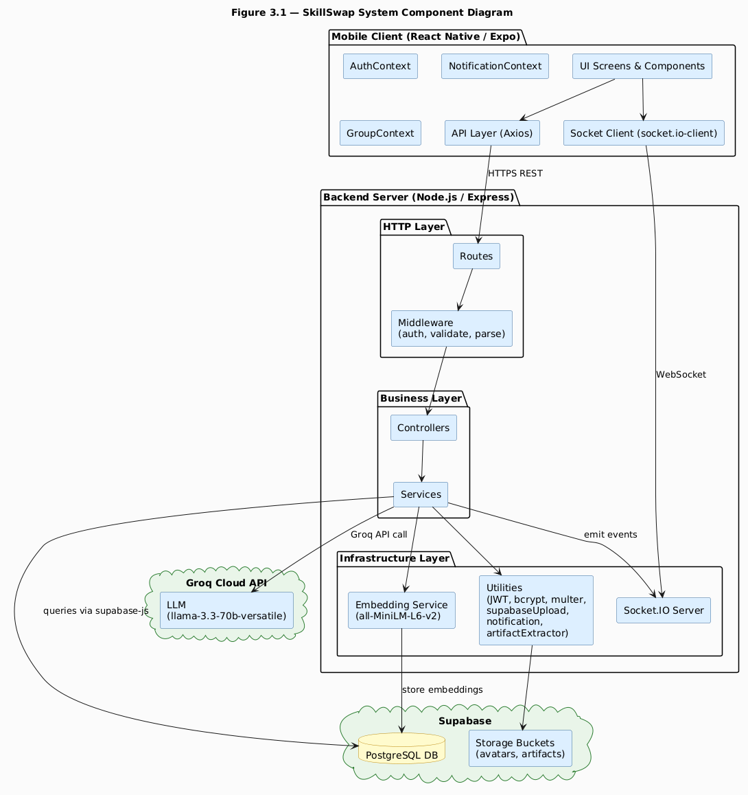

**Figure 3.1** - SkillSwap System Component Diagram

Figure 3.1 reveals the three-tier structure of the SkillSwap system. The mobile client communicates with the backend through two distinct channels: an HTTPS REST interface for all request-response operations and a WebSocket connection for real-time event delivery.The backend server is internally organized into three layers, HTTP, business, and infrastructure, each with clearly defined responsibilities. The backend in turn communicates with two external cloud services: Supabase for all data and file storage, and Groq for large language model inference.

The mobile client's architecture mirrors this separation. The API layer (Axios) handles all REST communication, while the Socket.IO client manages the WebSocket connection independently. Above these, three React Context providers: `AuthContext`, `NotificationContext`, and `GroupContext`, distribute shared state to the component tree without prop drilling.

The embedding service occupies an important position in the infrastructure layer. It is not a cloud service but an in-process model (`all-MiniLM-L6-v2` loaded via `@xenova/transformers`) that runs inside the backend Node.js process. This design choice, running the embedding model locally rather than calling an external embedding API,was made for cost and latency reasons: embedding generation happens asynchronously after artifact upload and does not block the HTTP response, making local inference preferable to an additional round-trip to an external service.

## 3.4 Backend Layer Breakdown

### 3.4.1 Entry Points - app.js and server.js

The backend entry point is split across two files with distinct responsibilities. `server.js` creates the HTTP server, attaches Socket.IO to it, and starts listening on the configured port. `app.js` configures the Express application: security headers via Helmet, CORS policy restricted to the client URL, body parsing middleware, and the registration of all route prefixes.

The following listing shows the route registration section of `app.js`, illustrating how the nine domain areas map to URL prefixes.

**Listing 3.1** - Route registration in `app.js`

```javascript
app.use("/api/auth", authRoutes);
app.use("/api/users", userRoutes);
app.use("/api/skills", skillRoutes);
app.use("/api/friends", friendRoutes);
app.use("/api/notifications", notificationRoutes);
app.use("/api/groups", groupRoutes);
app.use("/api/sessions", sessionRoutes);
app.use("/api/chat", chatRoutes);
app.use("/api/qa", qaRoutes);
```

Each prefix corresponds to a domain area of the application. The nine route modules collectively define the complete API surface of the backend. Every route beyond `/api/auth` requires the `authenticate` middleware, which verifies the JWT and attaches the user object to the request before any controller executes.

### 3.4.2 Middleware Layer

Three middleware modules operate in the backend.

**`auth.js`** is the authentication guard. It extracts the Bearer token from the `Authorization` header, verifies it using `verifyToken` from the JWT utility, fetches the corresponding user record from the database, and attaches the user object to `req.user`. If any step fails it returns a `401 Unauthorized` response immediately, preventing the request from reaching the controller.

**`validate.js`** is the validation middleware. It accepts a Joi schema as its argument and returns a middleware function that validates `req.body` against that schema. If validation fails, it returns a `400 Bad Request` response. If validation passes, it attaches the validated (and sanitized) data to `req.validatedData`, which controllers use instead of `req.body` directly. This ensures that controllers always receive data that has already been validated and stripped of unknown fields.

**`parse.js`** is a specialized middleware for multipart form data. When file uploads are handled by Multer, JSON fields within the form body arrive as strings rather than parsed objects. The `parseJsonFields` middleware accepts a list of field names and attempts `JSON.parse` on each, converting them to their native types before validation runs.

### 3.4.3 Utility Layer

Five utility modules provide reusable functionality to the service layer.

**`jwt.js`** wraps the `jsonwebtoken` library. Used to sign a token with the application's `JWT_SECRET`,and verify a token and return the decoded payload.

**`password.js`** wraps the `bcryptjs` library. Used to hash and validatepasswords. An important bug was encountered during development: the initial implementation of `register` in `authService.js` omitted the `await` keyword before `hashPassword`, causing the promise to be stored in the `password_hash` column rather than the resolved string. The password field in the database was recorded as `[object Promise]`. This was caught during testing and resolved by adding `await`.

**`supabaseUpload.js`** handles file persistence to Supabase Storage. It generates a UUID-based filename (to prevent collisions), uploads the file buffer to the specified bucket, and retrieves the public URL. An early version of this utility returned the entire `publicUrlData` object rather than `publicUrlData.publicUrl`, causing the full JavaScript object to be stored in the `icon_url` column of the skills table. This was corrected by extracting only the `.publicUrl` property.

**`notification.js`** is the cross-cutting utility for creating and delivering notifications. It inserts a single row into the `notifications` table, then maps over an array of recipient IDs to insert corresponding rows into the `user_notifications` table. It then iterates over the inserted notifications and emits each individually to the target user's personal Socket.IO room (`user:{userId}`). This design supports both single-recipient notifications (friend requests) and bulk notifications (new session created for all group members).

**`artifactExtractor.js`** handles text extraction from uploaded files and the generation and storage of vector embeddings. It supports PDF files via `pdf2json`, Word documents via `mammoth`, and plain text files via direct UTF-8 decoding.

## 3.5 API Design and Route Organization

Figure 3.2 presents a sequence diagram for one of the most representative flows in the backend: the session creation flow, which exercises authentication middleware, validation middleware, multipart file handling, database insertion, asynchronous embedding generation, notification delivery, and the Socket.IO layer simultaneously.

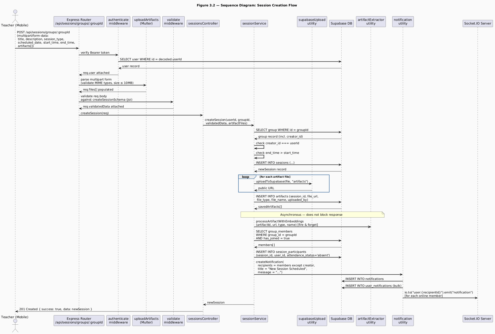

**Figure 3.2** - Sequence Diagram: Session Creation Flow

The session creation sequence illustrated in Figure 3.2 is one of the most complex flows in the entire backend because it exercises nearly every layer of the system simultaneously. Walking through the sequence reveals how the layered architecture distributes responsibility cleanly at each step.

The request arrives as a `multipart/form-data` POST because it carries both structured fields (title, description, dates, times) and binary file data (the artifact files). The `authenticate` middleware runs first, unconditionally, verifying the JWT and attaching the user record to the request. This happens before Multer processes the files, ensuring that anonymous callers never trigger file processing overhead.

Multer processes the multipart body next, storing the file buffers in memory and validating each file's MIME type and size before the request reaches the validation middleware. If any file fails the MIME check, Multer rejects the entire request. After Multer, the Joi validation middleware checks the text fields. These two middleware functions together ensure that both the structured data and the binary data meet the system's requirements before any business logic runs.

Inside `sessionService.createSession`, the first action is verifying that the requesting user is the group creator. This authorization check, not present in middleware but in the service layer, ensures that only the teacher of a specific group can create sessions for it. The service then validates that `end_time` is strictly after `start_time`, a temporal constraint that Joi cannot enforce without the paired field context.

After database insertion, artifact files are uploaded to the Supabase `artifacts` bucket and their URLs are recorded in the `artifacts` table. The embedding generation step that follows is deliberately fired asynchronously using a fire-and-forget pattern (`.catch` to handle errors silently). This design decision was critical: generating embeddings for a multi-page PDF can take several seconds, and blocking the HTTP response for that duration would produce an unacceptable user experience. The teacher receives a successful response immediately; embedding generation continues in the background.

The final phase of the sequence delivers notifications. The service fetches all group members with `has_joined = true`, constructs the participant records for the session, and calls the `notification` utility with the full array of recipient IDs. The utility inserts a single notification row and the corresponding `user_notifications` rows in a single bulk insert, then emits a Socket.IO event to each recipient's personal room.Members who are online receive the notification in real time; those who are offline will see it when they next open the application.

## 3.6 Authentication and Middleware Flow

Figure 3.3 presents a state diagram for the user account lifecycle, capturing the states a user account can occupy and the transitions between them. This diagram is
important for understanding how the authentication system interacts with the profile completion requirement and the password reset flow.

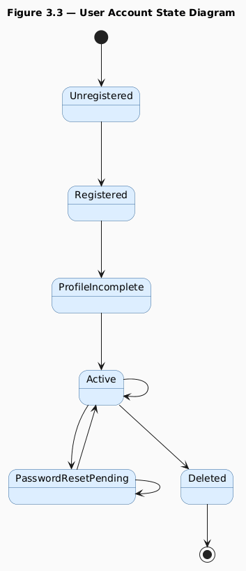

**Figure 3.3** - User Account State Diagram

The user account state diagram in Figure 3.3 reveals a design decision that has significant implications for both the backend and the frontend navigation architecture: the distinction between the `Registered` state and the `Active` state, mediated by profile completion.

When a user registers, the backend inserts a row into the `users` table with only three fields populated: `email`, `password_hash`, and `full_name`. All other profile fields, `nick_name`, `date_of_birth`, `gender`, `biography`, `education_level`, `profile_image_url`, are nullable and initially null. A JWT is issued immediately so that the client can make authenticated requests to complete the profile.

The frontend uses the presence or absence of `nick_name` as the signal for profile completion state. If the decoded user object returned from login contains no `nick_name`,the `RootNavigator` routes the user to the `ProfileCompletionNavigator` rather than the main tab navigation. This approach avoids a separate `is_profile_complete` boolean flag in the database and instead reuses a field that is naturally absent until completion. This was an intentional design choice that reduced schema complexity at the cost of a minor implicit coupling between the `nick_name` field and the completion state.

The password reset flow introduces a `PasswordResetPending` intermediate state. When a user requests a reset, the backend generates a cryptographically secure 32-byte random token using Node.js's `crypto` module, stores it with a one-hour expiry in the `password_resets` table, and emails it to the user. The token is single-use: after it is consumed by a successful reset, the row is deleted. Any existing reset tokens for the same user are deleted when a new request is made, preventing accumulation of stale tokens.

The account deletion flow deletes dependent records in a specific order to respect foreign key constraints: user skills first, then friendships, then settings, then the user row itself. Cascading deletes handle downstream records (group memberships, session participants, notifications) through database-level `ON DELETE CASCADE` constraints.

## 3.7 Key Code Excerpts

### 3.7.1 Authentication Middleware

The following listing shows the complete `authenticate` middleware, which is the most frequently executed piece of code in the entire backend, as it runs on every protected route.

**Listing 3.2** - `middlewares/auth.js`

```javascript
const authenticate = async (req, res, next) => {
  try {
    const authHeader = req.headers.authorization;
    const token = authHeader.substring(7);
    const decoded = verifyToken(token);
    req.user = user;
    next();
  } catch (error) {
    // return a 401 error message
  }
};
```

This middleware performs three sequential checks. The first check confirms that an `Authorization` header is present and begins with the string `"Bearer "`. The `substring(7)` call strips this prefix, extracting only the token string. The second check passes the token to `verifyToken`, which uses `jsonwebtoken.verify` internally. If the token is expired, tampered with, or signed with a different secret, `verifyToken` throws an error that is caught by the outer `try-catch`. The third check queries the database for the user whose ID appears in the decoded payload. This step is not redundant: it ensures that if a user's account has been deleted after the token was issued, the request is still rejected. The selected fields are intentionally limited. the password hash is
never attached to `req.user`.

### 3.7.2 Notification Utility - Bulk Delivery

The following listing shows the core of the notification utility, specifically the section that resolves the challenge of delivering notifications to multiple recipients.

**Listing 3.3** - `utils/notification.js` (core bulk delivery section)

```javascript
const userNotifications = recipients.map((r) => ({
  notification_id: notification.id,
  recipient_id: r,
  is_read: false,
}));
//Insert into the Database
for (const notification of insertedNotifications) {
  const recipientId = notification.recipient_id;
  io.to(`user:${recipientId}`).emit("notification", {
    type: "new_notification",
    data: notification,
  });
}
```

This design addresses a specific challenge identified during development. Initially, the notification utility accepted a single `recipient_id` and was called once per recipient in a loop. For group-wide notifications (session created, session cancelled), this meant N sequential database insertions for N group members, an approach that does not scale.

The revised design normalizes `recipient_id` to an array regardless of whether a single ID or an array is passed. All `user_notifications` rows for a given notification event are constructed as an array and inserted in a single bulk operation. The Socket.IO emission loop that follows then iterates over the inserted records, extracting each `recipient_id` to target the correct personal room. This approach is both more efficient (one insert operation regardless of group size) and more correct (the database insertion is atomic, either all recipients get the notification or none do).

## 3.8 Testing and Validation

Backend validation was conducted at three levels: schema validation, service logic testing, and integration testing through the mobile client.

**Schema validation** is implemented on all mutating endpoints using Joi schemas, enforcing strict rules on types, formats, and constraints such as dates and time patterns. Validation is configured with abortEarly: false to return all errors at once, allowing the frontend to receive complete feedback in a single response.

**Service logic testing** was performed manually by calling endpoints through the mobile client and inspecting both the API responses and the resulting database state through the Supabase dashboard. Key test cases included: registering with a duplicate email, creating a session as a non-creator, and uploading artifacts of disallowed types (confirmed Multer rejection before any business logic executed).

**Integration testing** was conducted by walking through complete user journeys end to end: a teacher creating a group, a learner requesting to join, the teacher approving, the teacher creating a session with artifacts, the learner checking in, the learner asking the AI a question, and verifying that the AI's answer referenced the uploaded content. All flows completed successfully after the documented backend bugs were resolved.

**Known defect addressed:** The `avatar` Supabase storage bucket initially rejected image uploads from the backend because the bucket's row-level security policy did not permit insertion by authenticated or anonymous service roles. This was resolved by adding an explicit insert policy to the bucket in the Supabase dashboard, allowing uploads from both `anon` and `authenticated` roles.

# Chapter 4: Database Design

## 4.1 Purpose of the Subsystem

The database is the foundational layer upon which every feature of SkillSwap rests. It is responsible for persisting all user data, skill and group records, session and artifact metadata, chat messages, poll data, notification records, Q&A conversation history, and the vector embeddings that power the AI pipeline. Every API request that reads or writes application state ultimately resolves to one or more queries against this database.

SkillSwap uses PostgreSQL as its database engine, hosted and managed through Supabase. PostgreSQL was chosen for its robustness, its support for advanced data types (including the vector data type required for embedding storage), its mature support for foreign key constraints and cascading deletes, and its JSON column support for storing embedding metadata. Supabase provides the managed PostgreSQL infrastructure along with the `@supabase/supabase-js` client library used throughout the backend service layer.

This chapter presents the complete database schema, the entity-relationship model, the normalization decisions that shaped the schema, the indexing and query strategy, and security considerations applied at the storage layer. Understanding the database design is prerequisite to understanding every other chapter in this report, because the shape of the data, how entities relate, what constraints are enforced at the database level, and where cascading behavior is defined, directly determines what the service layer can and cannot do efficiently.

## 4.2 Design Choices and Normalization

### 4.2.1 Normalization Level

The SkillSwap schema is designed to Third Normal Form (3NF) throughout. Every non-key attribute in every table depends on the whole primary key and nothing but the primary key. No transitive dependencies exist between non-key columns.

The most instructive example of a normalization decision is the separation of the `notifications` table from the `user_notifications` table. A naive design would store one notification row per recipient, duplicating the `title`, `message`,`related_entity_type`, `related_entity_id`, and `sender_id` fields for every member of a group when a session is created. With groups of up to fifty members, this would produce fifty nearly identical rows differing only in `recipient_id`.

The normalized design stores the notification content exactly once in `notifications` and creates one lightweight row per recipient in `user_notifications`, carrying only `notification_id`, `recipient_id`, and `is_read`. This separation achieves three things: it eliminates data duplication, it allows a single notification to be addressed to many recipients through a single insert (bulk insertion into `user_notifications`), and it allows per-recipient read state to be tracked independently without affecting the shared notification record.

### 4.2.2 UUID Primary Keys

All primary keys in the schema use UUIDs rather than auto-incrementing integers. UUID-based IDs are non-sequential and unpredictable, which prevents enumeration attacks where an attacker increments an integer ID to discover records they should not access.

The `uuid` npm package is used in the backend to generate v4 UUIDs for file names during Supabase Storage uploads. For database primary keys, Supabase's PostgreSQL instance generates UUIDs using the `gen_random_uuid()` function as the column default.

### 4.2.3 Cascading Deletes

Foreign key relationships in the schema are defined with `ON DELETE CASCADE` wherever the child record has no meaning without its parent. The most consequential cascade chains in the system are:

- Deleting a `groups` row cascades to: `group_members`, `sessions`, `group_chats`,`polls`, `qa_conversations`, and through `sessions` to `artifacts`, `session_participants`, and `artifact_embeddings`.
- Deleting a `polls` row cascades to: `poll_options` and `poll_votes`, and to the `chat_messages` row that references the poll (setting `poll_id` to null via `ON DELETE SET NULL`).
- Deleting a `users` row is handled explicitly in the service layer rather than through database cascades, because the order of deletion matters for foreign key constraint
  satisfaction and to allow the service to perform additional cleanup (removing files from Supabase Storage, for example).

  ### 4.2.4 The has_joined Column - Dual Purpose Design

A notable design decision is the use of a single `has_joined` boolean column in `group_members` to represent three distinct states: a join request from a learner (`has_joined = false`, inserted by the learner), a teacher invitation (`has_joined = false`, inserted by the teacher), and an approved membership (`has_joined = true`). The `role` column distinguishes between teacher and learner rows, and `has_joined` distinguishes between pending and active.

This dual-purpose design was chosen to avoid a separate `pending_requests` or `invitations` table that would have replicated most of the same columns. The trade-off is that the application layer must always filter `group_members` appropriately: `has_joined = true` for active members, `has_joined = false` for pending requests/invitations. This filtering is consistently applied throughout the service layer, and the pattern was documented early to prevent incorrect queries.

## 4.3 Entity-Relationship Diagram

Figure 4.1 presents the complete Entity-Relationship diagram for the SkillSwap database. All entities, attributes, and relationships are shown, including cardinality notations.

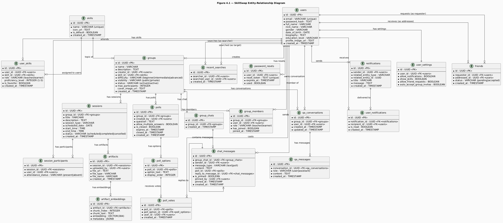

**Figure 4.1** - SkillSwap Entity-Relationship Diagram

The ER diagram in Figure 4.1 encompasses twenty-two tables organized around five domain clusters: the user and social layer, the skill layer, the group and session layer, the communication layer, and the AI layer. Each cluster is described in detail in the sections that follow.

## 4.4 Table-by-Table Schema Description

### 4.4.1 User and Social Domain

**`users`** is the central entity of the entire schema. It stores the core identity attributes of every registered user. The `password_hash` column stores the bcrypt hash of the user's password and is never selected in any query that returns data to the client; the authentication middleware's `SELECT` statement explicitly excludes it.

**`user_settings`** has a one-to-one relationship with `users`, enforced by a unique constraint on `user_id`. A settings row is created automically with the user row during registration, with all boolean settings initialized to `true`. This design ensures that every user always has a settings record, there is never a need to check for its existence before reading it.

**`friends`** models the bidirectional friendship relationship with a single directional row. A friendship between user A and user B is represented as one row with `requester_id = A` and `addressee_id = B`. The `status` column holds `pending` until the addressee accepts, at which point it is updated to `accepted`. Rejection and cancellation both result in the row being deleted rather than a status update. Queries for a user's friends must use an OR filter combining both columns: `requester_id = userId OR addressee_id = userId`, filtered to `status = accepted`.

**`recent_searches`** records every time a user taps on a search result, creating a record of the searcher-target pair with a timestamp.

**`password_resets`** is a transient table that holds active reset tokens.

### 4.4.2 Skill Domain

**`skills`** is a reference table that stores the platform's skill catalogue. The `is_default` flag distinguishes skills that were pre-populated by the platform administrators from custom skills created by users. The `name` column has a unique constraint to prevent duplicate skill names, the `createSkill` service function checks for an existing skill by name before inserting and returns the existing record if found, preventing the divergence problem described in Chapter 5 where two users creating the same custom skill would produce separate database rows.

**`user_skills`** is the join table that associates users with skills. The composite of `(user_id, skill_id, role)` is effectively unique: a user can have the same skill as both a teacher and a learner simultaneously. The `proficiency_level` integer (1–5) is the primary input to the group-skill matching algorithm: the `getAvailableGroupsForLearner` service maps the learner's proficiency to an allowed set of group difficulties before filtering the results. The `is_favorite` boolean is toggled by the user and controls the sort order on the home screen.

### 4.4.3 Group and Session Domain

**`groups`** represents the core organizational unit of the platform. Each group is associated with exactly one skill and one creator. The `difficulty` column stores one of three enumerated values (`beginner`, `intermediate`, `advanced`) which are matched against the learner's proficiency level during group discovery. The `visibility` column determines whether the group appears in public search results, as private groups are only joinable through a teacher invitation.

**`group_members`** is the join table between users and groups. As discussed in section 4.2.4, the `has_joined` boolean serves a dual purpose: `false` indicates either a pending join request (submitted by the learner) or a pending invitation (sent by the teacher), while `true` indicates an active, approved membership. The `role` column distinguishes the teacher row (created automatically when the group is created) from learner rows (created by join requests or invitations).

**`sessions`** represents a scheduled learning event within a group. The `session_type` column is an enumerated field with four values: `meeting`, `review`, `practice`, and `problem_solving`. The service layer validates that `end_time > start_time` before insertion. The `status` column transitions from `scheduled` to either `completed` or `cancelled` through explicit service actions.

**`session_participants`** is created atomically with each session: when a session is inserted, the service immediately inserts one row per current group member with `attendance_status = absent`. When a member checks in, their row is updated to `attendance_status = present`. This design means attendance tracking requires no separate "check-in" table, it is a status column on a pre-existing record.

### 4.4.4 Communication Domain

**`group_chats`** has a one-to-one relationship with `groups`. A chat room is created lazily, the first time any group member requests the group chat, the service checks for an existing record and creates one if absent.

**`chat_messages`** is the most query-intensive table in the schema. Every message, whether text or poll, is stored here. The `message_type` column distinguishes text messages from poll messages. Poll messages have a null `content` and a non-null `poll_id` foreign key. Text messages have a null `poll_id` and a non-null `content`. The `reply_to_message_id` is a self-referencing foreign key that enables threading: a message can reference another message in the same chat as its parent.

**`polls`**, **`poll_options`**, and **`poll_votes`** form the three-table poll system. The `polls` table stores question metadata and state flags. `poll_options` stores the individual answer choices with a `display_order` integer to preserve the intended presentation sequence. `poll_votes` records each vote as a row referencing both the poll and the specific option chosen by the voter.

**`notifications`** and **`user_notifications`** implement the split notification design described in section 4.2.1. The `related_entity_type` and `related_entity_id` columns on `notifications` form a polymorphic reference, `related_entity_type` identifies the domain (`friendship`, `group`, `session`, `Group General`) and `related_entity_id` holds the UUID of the relevant record.

### 4.4.5 AI Domain

**`qa_conversations`** represents a persistent conversation thread between a specific user and the AI within a specific group context.

**`qa_messages`** stores the individual messages within a conversation. The `role` column follows the OpenAI/Groq message format convention: `user` for the learner's question and `assistant` for the AI's response. Storing messages in this format allows the service to pass the conversation history directly to the Groq API as the `messages` array without any transformation.

**`artifact_embeddings`** stores the vector representations of text chunks extracted from uploaded artifacts. The `embedding` column stores a `VECTOR(384)` value, a 384-dimensional floating-point vector produced by the `all-MiniLM-L6-v2` sentence transformer model. The `chunk_text` column stores the original text of the chunk, which is passed directly to the language model as context when a relevant match is found. The `metadata` JSONB column stores supplementary information about each chunk: the source filename, the start and end word indices within the original document, and the word count. The `chunk_index` integer records the sequential position of the chunk within its source document, enabling future features such as ordered passage retrieval.

## 4.5 Indexing and Query Strategy

Foreign key columns frequently used in filtering operations, such as `group_members.group_id`, `group_members.user_id`, `artifacts.session_id`, `chat_messages.group_chat_id`, and `user_notifications.recipient_id`, were explicitly indexed to improve query performance on common application requests.

Vector similarity search is performed through a PostgreSQL stored function named `match_artifact_chunks`, called using Supabase’s `.rpc()` method. The function returns the most semantically similar artifact chunks for retrieval-augmented generation.

Chat message retrieval uses cursor-based pagination with a timestamp (`created_at`) rather than offset-based pagination. This improves scalability and ensures consistent results when new messages are inserted during pagination.

## 4.6 Security and Access Control

### 4.6.1 Row-Level Security on Supabase Storage

Supabase Storage enforces Row-Level Security (RLS) policies on its storage buckets, analogous to RLS on database tables. During development, a critical issue was encountered: the `avatars` bucket (used for profile images and group cover images) rejected all upload attempts from the backend because its default RLS policy did not permit `INSERT` operations from any role.

The resolution was to add explicit RLS policies to the `avatars` and `artifacts` buckets to allow `INSERT` operations using the `anon` role, which the backend uses for Supabase access. Public read access was also enabled so uploaded files and profile images could be accessed directly by the mobile client.

### 4.6.2 Password Storage

Passwords are never stored in plaintext. The `hashPassword` utility generates a random ten-character bcrypt salt and returns the salted hash. During login, `comparePassword` extracts the embedded salt from the stored hash, applies it to the input password, and compares the result. The salt ensures that two users with identical passwords produce different hashes, preventing rainbow table attacks and correlation between accounts.

### 4.6.3 Sensitive Column Exclusion

The `password_hash` field is explicitly excluded from all client-facing queries by selecting only required columns and removing the field during authentication processing. This prevents accidental exposure through generic queries such as `SELECT *`.

### 4.6.4 Authorization at the Service Layer

Application-level authorization in SkillSwap is enforced in the service layer rather than through database RLS policies. Since the backend uses a single Supabase client with the `anon` key, authorization checks such as ownership and membership validation are performed before executing database operations.

## 4.7 Testing and Validation

Database correctness was validated through four complementary approaches.

**Cascade delete verification** confirmed that deleting a group correctly removed all dependent records. After deleting a test group through the API, the Supabase dashboard confirmed that the corresponding records from `group_members`, `sessions`, `artifacts`, and related table were all removed without manual cleanup.

**Query correctness testing** addressed the most complex multi-table queries. The `getAvailableGroupsForLearner` service was tested with learners at proficiency levels 1, 3, and 5 to confirm that the difficulty mapping produced the correct group sets: level-1 learners saw only beginner and intermediate groups, level-3 learners saw all three difficulties, and level-5 learners saw only intermediate and advanced groups.

**Embedding pipeline validation** confirmed that artifact ingestion produced correctly structured records in `artifact_embeddings`. After uploading a test PDF, the Supabase table viewer confirmed that the expected number of chunks had been created, each with a non-null `embedding` array of exactly 384 dimensions, a non-empty `chunk_text`, and a populated `metadata` JSONB object. A subsequent Q&A question confirmed that the similarity search returned chunks from the uploaded document rather than an empty result set.

# Chapter 5: Frontend Design and User Experience

## 5.1 Purpose of the Subsystem

The frontend of SkillSwap is a cross-platform mobile application built with React Native and the Expo managed workflow. It serves as the sole interface through which users interact with the entire SkillSwap platform, from registering an account and completing a profile to managing groups, conducting sessions, chatting in real time, and consulting the AI Q&A assistant. Every backend capability described in the preceding chapters is exposed to the user exclusively through this application.

The frontend's responsibilities extend well beyond rendering screens. It manages authentication state and persists it across application restarts, maintains a real-time WebSocket connection for notification and chat delivery, enforces client-side form validation before any request reaches the server, and implements a complete design system that ensures visual consistency across every screen in the application.

This chapter documents the technology stack and rationale, the design system that governs visual presentation, the navigation architecture that structures the user journey, the component architecture and reusable component library, the state management strategy, the API integration layer, and a detailed walkthrough of the key screens with the design decisions and engineering challenges each one presented.

## 5.2 Design Choices and Alternatives Considered

### 5.2.1 Framework - React Native with Expo vs. Flutter vs. Native

React Native with Expo was selected over Flutter and native development because it leveraged existing JavaScript/TypeScript experience, reduced development effort, and provided built-in support for required mobile features through Expo’s SDK. Its direct compatibility with `socket.io-client` and the ability to share TypeScript types between frontend and backend also improved development productivity.

### 5.2.2 Language - TypeScript Throughout

TypeScript was used across the entire frontend to enforce compile-time type safety and prevent runtime mismatches between backend responses and frontend interfaces. Its typed navigation system centralized screen parameter definitions and eliminated errors caused by missing or incorrect navigation parameters.

### 5.2.3 State Management - Context API vs. Redux vs. Zustand

React’s Context API was chosen over Redux Toolkit and Zustand because the application only required lightweight shared state management for authentication, notifications, and group context. It provided a simple dependency-free solution that integrated naturally with React while avoiding the boilerplate and additional complexity of external state management libraries.

### 5.2.4 Form Management - Formik with Yup

All multi-field forms in the authentication and profile completion flows use Formik for form state management and Yup for validation schema definition. Formik handles the lifecycle of form values, touched state, error messages, and submission state, while Yup schemas define the validation rules declaratively.

## 5.3 Design System

The SkillSwap frontend is governed by a centralized design system defined in three files: `constants/colors.js`, `constants/spacing.js`, and `constants/typography.js`. Few color value, spacing value, font family, or font size is hardcoded in the application's component or screen files, as the majority of values reference a named constant from this system. This discipline was enforced from the first day of development and ensured that a global visual change (such as adjusting the primary blue tone) requires editing exactly one file.

### 5.3.1 Color System

The color palette is organized into five categories: the blue family for primary UI elements, the orange family for accents and call-to-action elements, semantic colors for status indicators and notifications, neutral colors for text and backgrounds, and gradient pairs used by the `GradientBackground` component.

### 5.3.2 Typography System

Five font families are loaded via Expo Google Fonts and accessed through a semantic `FONT_USAGE` mapping, where the most important roles are `heading`, `body`, and `button`, ensuring consistent typography without direct font-family usage in components. Additionally, The `FONT_SIZES` object provides a named scale from `xs: 12` through `massive: 40`, preventing raw pixel values in StyleSheets.

### 5.3.3 Spacing and Border Radius

The `SPACING` object provides nine named values from `xs: 4` to `massive: 48`. The `BORDER_RADIUS` object provides seven named values from `sm: 4` to `round: 999`. The `ICON_SIZES` object similarly provides named sizes for MaterialCommunityIcons usage.

## 5.4 Navigation Architecture

Figure 5.1 presents the complete navigation hierarchy of the SkillSwap frontend, showing how the five navigator types compose to produce the full application structure.

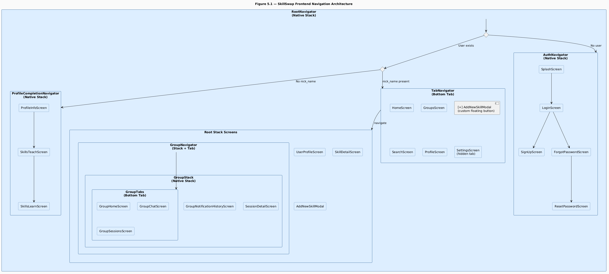

**Figure 5.1** - SkillSwap Frontend Navigation Architecture

The navigation architecture shown in Figure 5.1 is organized as a state-driven tree rooted in `RootNavigator`. The fundamental insight behind this architecture is that the navigator tree itself encodes the application's state machine: rather than using imperative `navigation.navigate()` calls to redirect users between authenticated and unauthenticated states, the navigator reads from `AuthContext` and renders the appropriate branch of the tree. This means it is structurally impossible for an unauthenticated user to access an authenticated screen, the navigator simply never renders it.

### 5.4.1 RootNavigator - State-Driven Routing

`RootNavigator` reads two values from `AuthContext` on every render: `isLoading` and `user`. While `isLoading` is true (during the initial `AsyncStorage` read on app boot), the navigator renders an `ActivityIndicator` overlay rather than any screen branch. This window prevents the navigator from briefly flashing the auth flow before the stored session is loaded.

Once loading resolves, the navigator evaluates two conditions in sequence. If `user` is null, the `AuthNavigator` branch is rendered. If `user` is non-null but `user.nick_name` is null or undefined, the `ProfileCompletionNavigator` branch is rendered. If both conditions are false, the user exists and has a nickname, the full authenticated experience is rendered, comprising the `TabNavigator` and the root-level stack screens (`UserProfileScreen`, `SkillDetailScreen`, `AddNewSkillModal`, and `GroupNavigator`).

The transition between branches is automatic: calling `signIn(token, userData)` in `AuthContext` updates the `user` value, which triggers a re-render of `RootNavigator`, which evaluates the conditions and renders the correct branch without any explicit navigation call from the login screen.

### 5.4.2 AuthNavigator

The authentication stack presents five screens: `SplashScreen`, `LoginScreen`, `SignUpScreen`, `ForgotPasswordScreen`, and `ResetPasswordScreen`. All five screens share a common visual pattern: a `GradientBackground` behind a card container with rounded top corners that appears to slide up from the bottom of the screen. This visual motif creates a consistent "lifting" aesthetic across all entry-point screens.

### 5.4.3 ProfileCompletionNavigator

The profile completion flow uses a three-screen stack: `ProfileInfoScreen`, `SkillsTeachScreen`, and `SkillsLearnScreen`. Data flows forward through navigation parameters: `ProfileInfoScreen` passes all profile form data to `SkillsTeachScreen`, which passes it along with the selected teaching skills to `SkillsLearnScreen`. The final screen submits everything in a single `PUT /api/users/complete-profile` call.

A significant challenge arose from the need to preserve skill selections when the user navigates backward and forward between the skill selection screens. React Navigation destroys and recreates screen components on backward navigation, which would clear the selected skills. This was resolved by persisting the selections to `AsyncStorage` under the keys `"TeachSkills"` and `"LearnSkills"` immediately on every toggle, and reading from `AsyncStorage` on screen mount. This pattern effectively makes `AsyncStorage` a temporary session store for the profile completion flow.

### 5.4.4 TabNavigator

The main application tab bar contains five visible entries, Home, Groups, Search, Profile, and a custom floating action button, plus a hidden Settings tab. The Settings tab is registered in the `TabParamList` with `tabBarItemStyle: { display: "none" }`, making it invisible in the tab bar but navigable programmatically from the Profile screen's settings icon.

The center tab button is replaced entirely by a custom `CustomTabBarButton` component that renders a floating elevated circle above the tab bar. Tapping it navigates to `AddNewSkillModal` as a root-level modal screen using `presentation: "modal"`.

### 5.4.5 GroupNavigator - Nested Navigation with Shared Context

When a user enters a group space, the app routes through `GroupNavigator`, a root-level stack that contains a nested group stack with bottom tabs (home, chat, sessions) and additional screens like notifications and session details. Group-level metadata is captured once by `GroupProvider` using route parameters and exposed via `GroupContext`, allowing all screens in the group hierarchy to access shared data without prop drilling or repeated API calls.

## 5.5 Component Architecture

### 5.5.1 Common Components

The `components/common/` directory contains seven reusable primitive components that are used throughout the application.

**`Button`** is the most widely used component in the application. It accepts four variant props (`primary`, `secondary`, `outline`, `ghost`), three size props (`small`, `medium`, `large`), and optional `loading`, `disabled`, `fullWidth`, and `icon` props.

**`Input`** provides a unified text input with label, error message, left icon, and right icon slots. It manages its own `isFocused` state to apply border color and width changes on focus.

**`Card`** is a pressable or non-pressable container with three visual variants: `elevated` (shadow), `outlined` (border), and `flat` (gray background).

**`Modal`** wraps React Native's built-in `Modal` component with keyboard avoidance, scrollable content, an overlay dismiss gesture, an optional close button, and a title header. The `size` prop (`small`, `medium`, `large`, `fullscreen`) controls the width of the modal container.

**`Badge`** renders a small colored pill label used throughout the application for status indicators, difficulty levels, and visibility labels.

**`ErrorToast`** is an animated slide-up notification that appears at the bottom of the screen. It uses `Animated.Value` to drive parallel `translateY` and `opacity` animations, sliding in from below and fading in simultaneously on show, and reversing on dismiss. The `useErrorToast` hook, described in section 5.6.3, provides the interface through which screens control this component.

**`GradientBackground`** wraps `expo-linear-gradient` and accepts a `variant` prop that maps to one of the five named gradient pairs in `COLORS.gradients`. It renders with `flex: 1` to fill its container. This component is used on all authentication screens, the Q&A panel background, and several card components in the group space.

### 5.5.2 Feature Components

The `components/features/` directory contains two complex feature components that are substantial enough to warrant their own files.

**`NotificationPanel`** is a floating panel above the home screen tab bar that displays notifications from `NotificationContext` and routes user actions through the appropriate backend APIs, with all state updates handled via context after each action.

**`QAPanel`** is a full-screen AI chat interface whose detailed implementation, including animations and conversation logic, is covered in Chapter 7.

## 5.6 State Management

### 5.6.1 AuthContext

`AuthContext` is the root-level context that governs all authentication state. It stores three values: `user` (the authenticated user object or null), `token` (the JWT string or null), and `isLoading` (a boolean that is true while the initial `AsyncStorage` read is pending).

The authentication context persists the user session by storing the token and user data in `AsyncStorage` while keeping React state in sync. On app startup, `loadUserData()` restores any saved session before rendering, using an `isLoading` flag to prevent flickering between auth and main navigation flows.

### 5.6.2 NotificationContext

`NotificationContext` manages the real-time notification state for the entire application. On mount (when a user is present), it performs two operations: it calls `GET /api/notifications` to load existing notifications from the backend, and it calls `connectSocket()` to establish the WebSocket connection.Incoming notifications are prepended to the local state, and unreadCount is derived directly from the notifications array to ensure consistency between derived and source state.

A shape normalization challenge was encountered during development. The backend returns notifications in a nested structure containing both the notification data and sender information. The frontend `Notification` TypeScript interface was designed to match this structure, ensuring consistent access across all components such as the `NotificationPanel` and unread count badge.

### 5.6.3 GroupContext

`GroupContext` is scoped to the `GroupNavigator` and provides all group-level data to every screen within the group space. It is populated from the navigation parameters passed to `GroupMain` via `useRoute()` inside the `GroupProvider` component.

### 5.6.4 useErrorToast Hook

Toast notifications are handled through a local `useErrorToast` hook on each screen rather than a global context, with internal state for visibility, message, and type. This ensures isolation between screens so toasts do not leak across navigation contexts, while still providing a consistent API for displaying error, success, warning, and info messages during API interactions.

## 5.7 API Integration Layer

### 5.7.1 Axios Instance with Interceptors

All REST communication is handled through a single Axios instance configured in `services/api.ts`. Two interceptors are registered on this instance.

The **request interceptor** automatically attaches the stored auth token from `AsyncStorage` as a Bearer token to every outgoing API request, removing the need for manual authentication handling in screens or hooks. The **response interceptor** handles `401 Unauthorized` errors by triggering `signOut()` from `AuthContext`, ensuring expired sessions are cleanly cleared and users are returned to the authentication flow.

### 5.7.2 Multipart Form Data Handling

Three endpoints require `multipart/form-data` rather than `application/json`: profile completion, profile image update, and session creation with artifacts. File objects are appended to `FormData` instances using the React Native file object format: `{ uri, name, type }` as the value rather than a `Blob`, which is not available in the React Native environment.

For artifact and image uploads, images are preprocessed using `expo-image-manipulator` to resize and compress them before upload, ensuring reduced payload size and consistent display across UI components.

## 5.8 Role-Based UI Rendering

A consistent pattern of role-based conditional rendering appears throughout the application. Rather than creating separate screens for teachers and learners, single screens read the user's role from context or route parameters and conditionally render subsections.

In the group space, the `isTeacher` boolean is derived by comparing `user.id` from `AuthContext` with `creatorId` from `GroupContext`. This boolean gates the following UI elements: the remove member button in the participants modal, the invite friends section, the send notification button in `GroupNotificationHistoryScreen`, the create session card in `GroupSessionsScreen`, the poll creation button in the chat input row, and the pin/unpin option in the chat context menu.

In `SkillDetailScreen`, the `role` parameter passed from `HomeScreen` determines whether the screen renders the teacher subsystem (skill mastery panel, created groups list, create group button) or the learner subsystem (active group preview, available groups search, join group flow). The two subsystems share the header, the skill icon panel, and the proficiency progress bar, avoiding duplication of the common layout.

The Q&A floating button is rendered only for learners, controlled by `{userRole === "learner" && ...}` in `GroupNavigatorContent`.

## 5.9 Key Screens Walkthrough

### 5.9.1 HomeScreen

`HomeScreen` is the central hub of the authenticated experience. It renders the user's skill cards filtered by the currently selected role and provides search, favorites filtering, and navigation entry points into the group space for each skill.

The role toggle in the header persists the selected role to `AsyncStorage` under the key `"userRole"`, ensuring that the last selected role is restored on app launch. Role changes trigger a reload of both the skill list and the group list.

A floating notification bell button, positioned absolutely at the bottom-right of the screen, shows the `unreadCount` badge from `NotificationContext`. Tapping it toggles the `NotificationPanel` overlay.

### 5.9.2 AddNewSkillModal

`AddNewSkillModal` was redesigned during development after a critical flaw was identified in the original design. The original modal allowed users to create a new custom skill by entering a name and selecting an icon, but this approach allowed two users to create two separate database rows for the same skill (for example, "Football" and "Football"), causing those users' groups to be invisible to each other, a group created under user A's "Football" skill ID would not appear in user B's group search results for their different "Football" skill ID.

The redesigned modal operates in two modes. **Browse mode** loads all existing skills (default and custom) from `GET /api/skills/all` and presents a searchable list, where the user can select from an existing list of skills. A "Can't find your skill? Create one" link at the bottom switches to **create mode**, which presents the original form for genuinely new skills. In create mode, the backend checks for a skill with the same name before inserting and returns the existing record if found, preventing duplicates at the database level as well as the UI level.

### 5.9.3 SkillDetailScreen

`SkillDetailScreen` is the bridge between the home screen and the group space. It renders entirely different content for teachers and learners while sharing the same header, skill icon container, and proficiency progress bar.

For the teacher, the screen shows a Skill Mastery panel and a list of groups they have created for this skill. A "Create Group" button opens a creation modal.

For the learner, the right panel shows a preview of the first group they are enrolled in for this skill, or an empty state if they have not joined any. Below, a searchable list of available groups appears, filtered by the backend to exclude groups the learner is already in, groups that are full, and groups whose difficulty is incompatible with the learner's proficiency level. Tapping a group card fetches the full group details and opens a join modal showing additional details about the group. The join button calls `POST /api/groups/:groupId/join` and shows a success toast on approval.

### 5.9.4 GroupChatScreen

`GroupChatScreen` is the most technically complex screen in the application. It manages a Socket.IO room connection, loads paginated message history, renders both text and poll message types inline, handles message long-press context menus with animation, supports reply threading with quoted previews, and provides poll creation for teachers.

The screen initializes by calling `getGroupChat(groupId)` to get or create the chat room. The socket room is joined with `emit("join-group- chat", chatId)`, and listeners are registered for six socket events: `new-message`, `message-deleted`, `message-pinned`, `message-unpinned`, `poll-updated`, and `poll-closed`.

Poll messages present a particular rendering challenge because polls are not self-contained: a poll message in the chat carries only a `poll_id` reference, and the poll details (question, options, vote counts, user's current votes) must be fetched separately. When the message list is loaded, all `poll_id` values are extracted and fetched in parallel using `Promise.allSettled()`.

Vote interactions use an optimistic update pattern: when the user taps a poll option, the `pollsMap` is immediately updated with the new `user_voted` array before the API call resolves. If the API call fails, a fresh `fetchPoll` corrects the state. This makes voting feel instantaneous even over a slow connection.

Figure 5.2 presents a sequence diagram for the chat initialization and message delivery flow, capturing the interaction between the mobile screen, the REST API, and the WebSocket layer.

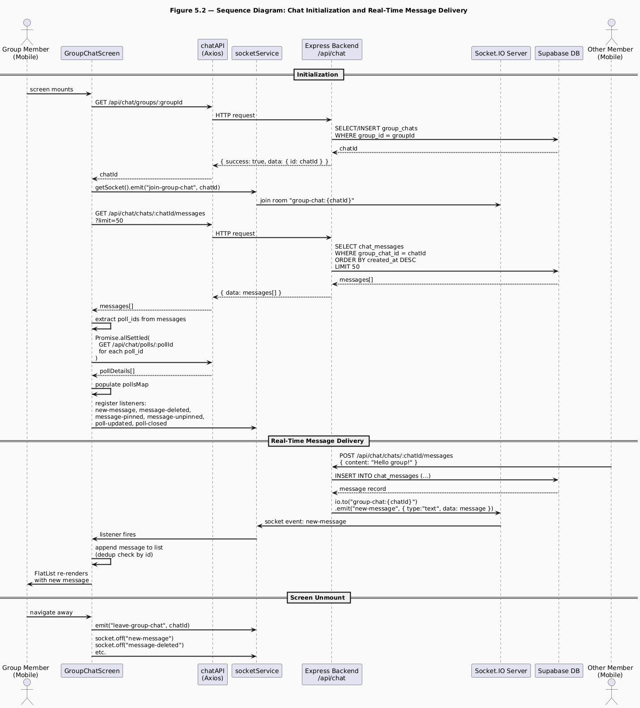

**Figure 5.2** - Sequence Diagram: Chat Initialization and Real-Time Message Delivery

As Figure 5.2 illustrates, the chat screen initialization involves three sequential phases. In the first phase, the screen calls the REST API to obtain or create the group chat room and immediately joins the corresponding Socket.IO room. In the second phase, the message history is loaded via REST and poll details are batch-fetched in parallel, populating the `pollsMap` before the first render. In the third phase, socket listeners are registered for all real-time events. This ordering is important: if listeners were registered before the history load completed, incoming messages could arrive and be appended before the history was in place, producing out-of-order display.

The deduplication check in the `new-message` listener (`if (prev.find(m => m.id === msg.id)) return prev`) is necessary because the message sender also receives the socket event they triggered. Without deduplication, the sender's message would appear twice.

On screen unmount, the `leave-group-chat` event is emitted to remove the socket from the room, and all listeners are deregistered with `socket.off()`. This cleanup is critical to prevent memory leaks and to prevent stale listeners from firing on subsequent visits to the same screen.

## 5.10 Testing and Validation

Frontend testing was conducted across three dimensions: navigation flow, role-based rendering, and real-time feature verification.

**Navigation flow** was verified by walking through the complete user journey from launch to an active group session. This included the cold-launch token restoration path (launching the app after storing a valid session), the profile completion redirect (a user with no `nick_name` being routed to the completion flow), and the group navigation path (entering and exiting the group space through `SkillDetailScreen`).

**Role-based rendering** was tested by togglin between a teacher and a learner and verifying that the expected UI elements appeared and were absent for each role. The teacher saw the create session card, the poll button, the pin context menu option, and the remove member button. The learner saw the Q&A floating button, the attendance check-in button, and the vote interface on polls.

**Real-time verification** was tested by running two instances of the application simultaneously on two physical devices connected to the same backend. Messages sent on one device appeared on the other within one second. Notifications triggered by server events (session creation, friend request) appeared on the recipient device without page refresh.

# Chapter 6: Real-Time Features - Socket.IO and Notifications

## 6.1 Purpose of the Subsystem

The real-time subsystem of SkillSwap is the layer responsible for delivering information to connected clients at the moment it becomes relevant, without requiring the client to poll the server. It underpins two distinct product features: the notification system, which alerts users to social and group events such as friend requests, join approvals, and session announcements, and the group chat system, which delivers messages, poll updates, pin events, and message deletions to all members of a chat room simultaneously.

Without a real-time layer, every feature that currently delivers information instantaneously would require the client to periodically poll the server, a pattern that wastes bandwidth, increases server load, and produces a degraded user experience characterized by visible latency between an event occurring and the user seeing it. The WebSocket protocol, implemented through Socket.IO, eliminates this latency by maintaining a persistent bidirectional connection between each client and the server.

The real-time subsystem is tightly integrated with the REST API layer. It does not replace REST, API calls remain the mechanism for all request-response operations such as fetching message history, loading notification lists, and submitting actions. Instead, the real-time layer augments the REST layer by notifying clients when the state they have already fetched has changed, allowing them to update their local UI without a new fetch. Understanding how these two communication channels cooperate is the central concern of this chapter.

## 6.2 Design Choices and Alternatives Considered

### 6.2.1 WebSocket Library - Socket.IO vs. Raw WebSocket vs. Supabase Realtime

Three real-time communication approaches were evaluated: raw WebSocket, Supabase Realtime, and Socket.IO. Raw WebSocket was rejected because it lacks built-in reconnection, room management, acknowledgements, and fallback transport, making implementation more complex and less reliable. Supabase Realtime was also unsuitable because it broadcasts database-level events rather than application-level messages, requiring additional fetch requests for complete chat data and conflicting with the application’s JWT authentication system.

Socket.IO was selected because it provides automatic reconnection, room-based communication, and HTTP long-polling fallback, making it more reliable in unstable networks. It also integrates directly with Express.js and works seamlessly in React Native through the `socket.io-client` package without requiring native adaptations.

### 6.2.2 Same-Server vs. Separate Real-Time Service

A separate Socket.IO microservice was considered for scalability, since it would allow the real-time server to scale independently from the REST API. However, for SkillSwap’s current scale, Socket.IO was co-located with the Express server to simplify deployment and allow service modules to emit events directly through a shared singleton Socket.IO instance.

### 6.2.3 Notification Delivery - Real-Time Only vs. Hybrid Persistent/Real-Time

An initial design considered using only Socket.IO for notifications, but this would cause notifications sent to offline users to be lost permanently. Instead, a hybrid approach was adopted where notifications are first stored in the database and then emitted through Socket.IO to connected users. This ensures notifications remain available even when recipients are offline, at the cost of an additional database write.

## 6.3 Socket Architecture

Figure 6.1 presents the Socket.IO architecture diagram, showing the room structure, the authentication middleware, and the event flows between clients and the server.

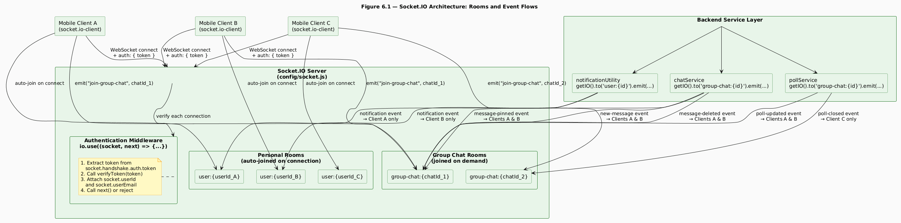

**Figure 6.1** - Socket.IO Architecture: Rooms and Event Flows

Figure 6.1 reveals the two-tier room structure at the heart of the real-time subsystem. Every client that connects to the Socket.IO server is automatically enrolled in exactly one personal room (`user:{userId}`) and may optionally join one or more group chat rooms (`group-chat:{chatId}`). These two room types serve fundamentally different purposes and carry fundamentally different event payloads.

**Personal rooms** are the delivery channel for notifications. No message is broadcast to users who are not the intended recipients. Every authenticated connection automatically joins its personal room on the `connection` event, before any application-level logic runs, ensuring that notifications can be delivered from the moment the client connects.

**Group chat rooms** are the delivery channel for all chat-related events. A client joins a group chat room by emitting a `join-group-chat` event with the `groupChatId` when `GroupChatScreen` mounts, and leaves by emitting `leave-group-chat` when the screen unmounts. Multiple clients can occupy the same group chat room simultaneously, and any event emitted to that room is received by all of them.

The authentication middleware enforces that only authenticated users can establish a WebSocket connection. The `io.use()` hook runs before any `connection` event handler, extracting the JWT from `socket.handshake.auth.token` and calling `verifyToken`. If the token is absent or invalid, `next(new Error(...))` is called, which rejects the connection entirely. If verification succeeds, `socket.userId` and `socket.userEmail` are attached to the socket object, making the authenticated user's identity available to all subsequent event handlers for that connection.

## 6.4 Socket.IO Server Initialization

The Socket.IO server is initialized in `config/socket.js` and attached to the same `http.Server` instance that serves the Express application. The following listing shows the server initialization, including the authentication middleware and the connection handler.

**Listing 6.1** - `config/socket.js`: Socket.IO server initialization

```javascript
const initializeSOcket = (server) => {
  io = new Server(server, {
    cors: {
      origin: config.clientUrl,
      credentials: true,
    },
  });

  // Authentication middleware
  io.use((socket, next) => {
    try {
      const decoded = verifyToken(socket.handshake.auth.token);
      socket.userId = decoded.userId;
      next();
    } catch {
      next(new Error("Authentication error"));
    }
  });

  io.on("connection", (socket) => {
    // Join personal notification room
    socket.join(`user:${socket.userId}`);

    socket.on("join-group-chat", (groupChatId) => {
      socket.join(`group-chat:${groupChatId}`);
    });

    socket.on("leave-group-chat", (groupChatId) => {
      socket.leave(`group-chat:${groupChatId}`);
    });
  });
  return io;
};
```

This listing illustrates several key decisions. The CORS configuration on the Socket.IO server mirrors the CORS configuration on the Express application, restricting WebSocket upgrade requests to the known client URL. The `io.use()` middleware runs synchronously before any `connection` event, meaning that the `socket.userId` property is guaranteed to be set by the time the `connection` handler executes, there is no race condition between authentication and room joining.

`io.on()` registers server-level events, most importantly the `connection` event that fires whenever a new client connects to the Socket.IO server. Inside this connection handler, `socket.on()` is used to listen for events emitted by that specific connected client, such as joining chats or sending typing indicators.

## 6.5 Notification System Design

Figure 6.2 presents a sequence diagram for the notification creation and delivery flow, tracing the complete path from a triggering event (in this case, a teacher approving a learner's group join request) through database storage and real-time delivery.

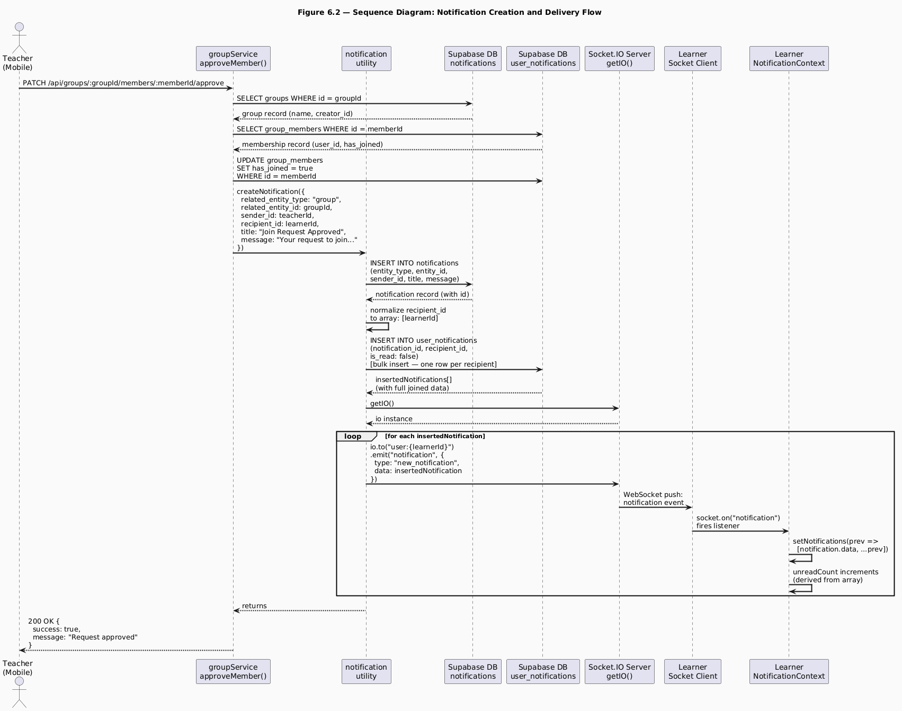

**Figure 6.2** - Sequence Diagram: Notification Creation and Delivery Flow

The notification delivery sequence shown in Figure 6.2 illustrates the hybrid design described in section 6.2.3: the notification is persisted to the database before any real-time delivery attempt is made. This ordering is deliberate and important. Writing notifications to the database before emitting them through Socket.IO ensures consistency between real-time updates and persisted data. If emission occurred first and the database write failed, users could temporarily see notifications that disappear on the next fetch because they were never stored.

The notification utility's normalization of `recipient_id` to an array deserves attention. This single line of code, `const recipients = Array.isArray(recipient_id) ? recipient_id : [recipient_id]`, makes the utility polymorphic: it handles both single-recipient events (friend request, approval notification) and bulk-recipient events (new session notification to all group members, cancellation notification to all participants) through the same code path.

The bulk insert of `user_notifications` rows is a single database operation regardless of the number of recipients. For a group with the maximum fifty members, this means one INSERT statement with fifty value tuples rather than fifty sequential INSERT statements.

The `NotificationContext` listener on the client side simply prepends the incoming notification object to the local `notifications` array. The `unreadCount` value is then automatically updated because it is derived from the array via a `.filter()` call rather than stored as separate state.

### 6.5.1 Notification Types and Frontend Handling

SkillSwap defines six notification types using a combination of `related_entity_type` and `title`, which the `NotificationPanel` uses to determine UI behavior.

**Friend request notifications** (`friendship`, "New Friend Request") show Accept/Reject actions using `related_entity_id` as the friendship row ID. Accepted friend notifications are informational only and are auto-marked as read.

**Group join request notifications** (`group`, "New Join Request") provide Approve/Reject actions but require an extra lookup: the system fetches group details to resolve the `group_members.id` from `sender_id`, since only `groupId` is stored in the notification.

**Join Request Approved notifications** (`related_entity_type: "group"`, `title: "Join Request Approved"`) are informational for the learner and render without action buttons.

**Group invitation notifications** (`group`, "Group Invitation") allow direct Accept/Decline using the `groupId`.

**Session-related notifications** (`session` / "Group General") are informational and are shown in the `GroupNotificationHistoryScreen` view, while the main notification panel only displays `friendship` and `group` notifications.

### 6.5.2 Auto-Accept Group Invitations

The `NotificationPanel` component accepts an `autoAcceptGroupInvites` prop that is populated from the user's settings via the `useUserSettings` hook. When this setting is enabled, the panel executes a `useEffect` on open that scans the current notifications array for unread group invitation notifications and calls `handleGroupInviteAction(notification, "accept")` for each one automatically.

## 6.6 Real-Time Chat Event Reference

The chat subsystem defines six server-to-client events and two client-to-server events. Table 6.1 provides a complete reference for all real-time events in the chat subsystem.

**Table 6.1** - Real-Time Chat Event Reference

| Direction       | Event Name         | Emitter                     | Payload                                   | Recipient        |
| --------------- | ------------------ | --------------------------- | ----------------------------------------- | ---------------- |
| Server → Client | `new-message`      | `chatService.sendMessage`   | `{ type: "text"\|"poll", data: message }` | All room members |
| Server → Client | `message-deleted`  | `chatService.deleteMessage` | `{ messageId }`                           | All room members |
| Server → Client | `message-pinned`   | `chatService.pinMessage`    | `{ messageId, pinnedBy }`                 | All room members |
| Server → Client | `message-unpinned` | `chatService.unpinMessage`  | `{ messageId }`                           | All room members |
| Server → Client | `poll-updated`     | `pollService.votePoll`      | `{ pollId, userId, optionIds }`           | All room members |
| Server → Client | `poll-closed`      | `pollService.closePoll`     | `{ pollId }`                              | All room members |
| Client → Server | `join-group-chat`  | `GroupChatScreen` (mount)   | `groupChatId`                             | Server only      |
| Client → Server | `leave-group-chat` | `GroupChatScreen` (unmount) | `groupChatId`                             | Server only      |

As Table 6.1 shows, all server-to-client events are directed to the full group chat room, meaning every member present in the room receives every event. The `poll-updated` event carries only the identifiers needed to trigger a client-side refetch of the poll details (`pollId`, `userId`, `optionIds`) rather than the full updated poll object. This was a deliberate design choice: the full poll detail, including the aggregated vote counts for all options, requires a database aggregation query that is more efficiently performed once on demand than embedded in every `poll-updated` emission.

## 6.7 Socket Connection Lifecycle on the Mobile Client

Figure 6.3 presents a state diagram for the Socket.IO connection lifecycle as experienced by the mobile client, from application launch through active usage to disconnection and reconnection.

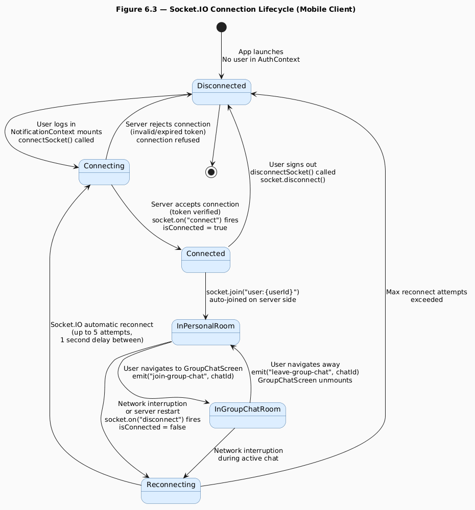

**Figure 6.3** - Socket.IO Connection Lifecycle (Mobile Client)

The connection lifecycle diagram in Figure 6.3 reveals that the Socket.IO connection is not established at application launch but at the point where the user is confirmed as authenticated, specifically when `NotificationContext` mounts, which only occurs inside the authenticated branch of `RootNavigator`.

The `connectSocket()` function in `services/socketService.ts` implements a singleton pattern: if a socket instance already exists, it returns the existing connection rather than creating a new one. This prevents multiple WebSocket connections from being established if `NotificationContext` re-mounts due to a React tree update. The `disconnectSocket()` function is called when the user signs out, explicitly closing the connection.

The reconnection configuration, up to five attempts with a one-second delay between each, is specified in the `io()` constructor call in `socketService.ts`. Socket.IO handles reconnection automatically without any application-level code, including re-joining the personal room on reconnection because the `join` call in the `connection` event handler on the server fires for every connection event, including reconnections. Group chat rooms, however, are not automatically re-joined on reconnection because the `join-group-chat` event is emitted by `GroupChatScreen` on mount, not by the Socket.IO server on connection.

## 6.8 Key Code Excerpts

### 6.8.1 Chat Message Delivery with Socket Emission

The following listing shows the message sending logic in `chatService.js`, specifically the portion that creates the message record and emits it to the group chat room.

**Listing 6.2** - `services/chatService.js`: sendMessage (socket emission section)

```javascript
const { data: message, error: messageError } = await supabase
  .from("chat_messages")
  .insert([
    {
      group_chat_id: groupChatId,
      sender_id: userId,
      message_type: "text",
      content,
      reply_to_message_id: reply_to_message_id || null,
    },
  ])
  .select
  // Chat message details
  ()
  .single();

if (messageError) {
  throw new Error(`Failed to send message: ${messageError.message}`);
}

getIO().to(`group-chat:${groupChatId}`).emit("new-message", {
  type: "text",
  data: message,
});
return message;
```

This listing illustrates the pattern used throughout the chat service: the database insert and the socket emission use exactly the same data. The `.select()` call on the insert retrieves the fully joined message record, including the sender's profile data and the reply-to message data, in a single database round-trip. This joined record is then emitted directly over the socket, meaning that receiving clients have all the information they need to render the message immediately, without making any additional API calls. The HTTP response returns the same record to the sending client, ensuring consistency between the sender's local state and the state delivered to other members.

### 6.8.2 Poll Vote with Optimistic Update and Socket Emission

The following listing shows the relevant section of `pollService.votePoll`, illustrating how optimistic update, database write, and socket emission cooperate.

**Listing 6.3** - `services/pollService.js`: votePoll (key sections)

```javascript
// Delete existing votes from this user for this poll
await supabase
  .from("poll_votes")
  .delete()
  .eq("poll_id", pollId)
  .eq("user_id", userId);

// Insert new votes
const votes = option_ids.map((optionId) => ({
  poll_id: pollId,
  poll_option_id: optionId,
  user_id: userId,
}));

const { data: createdVotes, error: voteError } = await supabase
  .from("poll_votes")
  .insert(votes)
  .select();

// Fetch updated poll details for response
const updatedPoll = await PollService.getPollDetails(userId, pollId);

// Emit real-time update to room
const { data: chat } = await supabase
  .from("group_chats")
  .select("id")
  .eq("group_id", poll.group_id)
  .single();

if (chat) {
  const io = getIO();
  io.to(`group-chat:${chat.id}`).emit("poll-updated", {
    pollId,
    userId,
    optionIds: option_ids,
  });
}

return updatedPoll;
```

The delete-then-insert pattern for votes implements a clean re-vote mechanism: a user who changes their vote does not accumulate multiple vote rows for the same poll. Deleting all existing votes before inserting new ones ensures that the vote state is always correct regardless of whether the user is voting for the first time or changing a previous vote.

The `poll-updated` event carries only the `pollId`, `userId`, and `optionIds` rather than the full updated poll state. This is intentional: computing the full poll state with accurate vote counts requires a database aggregation query. Rather than performing this query on the server and embedding the result in the event payload, the server signals that a change has occurred and leaves each client to fetch the updated state on demand.

## 6.9 Testing and Validation

Real-time feature testing was conducted using two physical mobile devices running the application simultaneously, connected to the same backend instance.

**Notification delivery** was tested for all six notification types. A friend request sent from Device A appeared on Device B's notification panel within one second, with the correct title, message, sender name, and action buttons. The unread count badge on Device B's bell icon incremented immediately. After accepting the request on Device B, the notification was removed from the panel on Device B and a "Friend Request Accepted" notification appeared on Device A.

**Chat message delivery** was tested by sending messages alternately from each device and verifying that messages appeared on the recipient device within one second. Reply threading was tested by replying to a specific message and verifying that the quoted preview appeared correctly on both devices. Message deletion was tested by long-pressing a message on Device A and selecting Delete, the message disappeared from both Device A and Device B's message lists within one second.

**Poll interaction** was tested by creating a poll on the teacher's device (Device A) and verifying that it appeared as an inline message on the learner's device (Device B). Voting on Device B triggered a `poll-updated` event; the vote counts on Device A updated within two seconds after the client-side refetch completed. Closing the poll on Device A triggered a `poll-closed` event; the "Closed" badge appeared on Device B within one second.

**Offline notification persistence** was tested by sending a friend request to a user who was not connected to the server. When that user subsequently launched the application and `NotificationContext` called `GET /api/notifications`, the friend request notification appeared correctly, confirming that the hybrid persistent/real-time design delivers notifications reliably regardless of the recipient's online status at the time the event occurred.

# Chapter 7: AI Component - RAG-Based Q&A System

## 7.1 Purpose of the Subsystem

The AI component of SkillSwap is a Retrieval-Augmented Generation (RAG) pipeline that provides learners with an intelligent question-answering assistant grounded exclusively in the course materials uploaded by their teacher. It is the most technically sophisticated subsystem in the application, combining document processing, natural language understanding, vector mathematics, database-level similarity search, and large language model inference into a single coherent pipeline.

The purpose of the AI component is precisely defined: it answers questions about the content of a specific group's session artifacts. It does not answer general knowledge questions, it does not draw on information from other groups, and it does not generate responses from the model's pre-trained world knowledge when the relevant information is absent from the course materials. When a learner asks a question that cannot be answered from the uploaded content, the system is designed to say so explicitly and direct the learner to their teacher, preserving the primacy of the teacher-learner relationship rather than substituting the AI for it.

This design philosophy directly shaped every technical decision in the pipeline: the choice to use a local embedding model rather than a general-purpose API, the choice of retrieval parameters, the construction of the system prompt, and the session-targeting mechanism that allows learners to ask questions about a specific session's materials.

## 7.2 Design Choices and Alternatives Considered

### 7.2.1 RAG vs. Full-Context Injection

The first and most fundamental architectural decision was whether to use a Retrieval-Augmented Generation approach or a full-context injection approach.

**Full-context injection** would send all uploaded artifact text to the model, but it does not scale well due to context window limits and degraded response quality from irrelevant content. **RAG** was chosen instead because it retrieves only the most semantically relevant passages, keeping token usage efficient and improving response focus, at the cost of added retrieval infrastructure complexity.

### 7.2.2 Embedding Model - Local vs. Cloud API

Two approaches to generating text embeddings were evaluated: using a cloud embedding API (such as OpenAI's `text-embedding-3-small`) and running a local embedding model in-process.

Cloud embedding APIs were rejected due to per-request cost, network latency, and external service dependency during both ingestion and retrieval. Instead, a local embedding model (`all-MiniLM-L6-v2`) was used via `@xenova/transformers`, which provides a pure JavaScript implementation of the Hugging Face Transformers inference pipeline, allowing models to run directly in Node.js without requiring Python, a separate service, or native bindings. The model is loaded once and cached in memory, enabling efficient reuse across requests while keeping the system fully self-contained.

### 7.2.3 Language Model - Groq vs. OpenAI vs. Self-Hosted

Three options were evaluated for the language model that generates the final answer: a self-hosted open-source model, OpenAI's GPT series, and Groq's API.

**Self-hosted models** were considered but rejected due to the need for GPU infrastructure, which is not available in the production environment and would introduce additional operational complexity and cost. **OpenAI** models were also evaluated but excluded due to per-token pricing, which conflicts with the goal of keeping the platform freely accessible. **Groq** was ultimately selected as the LLM provider, using `llama-3.3-70b-versatile` running on its LPU infrastructure to deliver low-latency inference with no per-token cost, making it suitable for a production-ready, always-available system.

### 7.2.4 Chunking Strategy

Text documents must be split into chunks before embedding because embedding models operate on passages of limited length, and because granular chunks improve retrieval precision. Several chunking strategies exist: fixed-size character chunks, fixed-size word chunks with overlap, sentence-boundary chunks, and paragraph-boundary chunks.

SkillSwap uses **fixed-size word chunks with overlap**, implemented in `embeddingService.chunkText()`. Each chunk is 500 words with a 50-word overlap between consecutive chunks. The 50-word overlap ensures that information spanning a chunk boundary is represented in at least one complete chunk, preventing the case where a sentence split across two chunks is retrieved as two incomplete fragments.

Word-based chunking was preferred over character-based chunking because word counts are more semantically meaningful, a 500-word chunk reliably contains a coherent passage, whereas a 2,000-character chunk may cut mid-sentence. Sentence-boundary chunking was considered but rejected because it requires a sentence tokenizer, adding a dependency, and because 500-word chunks already align well with natural paragraph and section boundaries in the types of documents (lecture notes, exercise sheets, textbook excerpts) that teachers are likely to upload.

## 7.3 RAG Pipeline Architecture

Figure 7.1 presents the complete RAG pipeline as two distinct phases: the **ingestion phase**, which processes uploaded artifacts into stored embeddings, and the **query phase**, which processes a learner's question and generates a grounded answer.

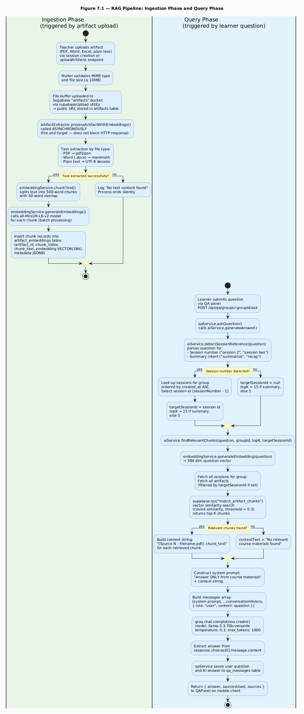

**Figure 7.1** - RAG Pipeline: Ingestion Phase and Query Phase

The RAG pipeline illustrated in Figure 7.1 divides cleanly into two phases that operate at different times and are triggered by different user actions.

The ingestion phase is triggered whenever a teacher uploads one or more artifacts, either during session creation or through the post-creation artifact upload endpoint. It runs entirely asynchronously, meaning the teacher's HTTP response is returned immediately after the artifact metadata is stored in the database, and the embedding generation continues in the background. This fire-and-forget pattern was critical for user experience: generating embeddings for a large PDF can take several seconds, and blocking the HTTP response for that duration would produce an unacceptable wait for the teacher.

The query phase is triggered by a learner submitting a question through the Q&A panel. Unlike ingestion, the query phase is synchronous from the learner's perspective: the panel displays a thinking indicator until the answer arrives. The pipeline executes five sequential operations: session detection, chunk retrieval, context construction, prompt assembly, and model inference, before returning the answer to the client.

## 7.4 Artifact Ingestion and Text Extraction

### 7.4.1 Text Extraction by File Type

Text extraction is handled by `artifactExtractor.extractTextFromArtifact()`, which receives the artifact's public URL, MIME type, and filename. It fetches the file content from the URL as an `ArrayBuffer`, converts it to a Node.js `Buffer`, and
applies the appropriate extraction strategy based on the file type.

**PDF extraction** uses the `pdf2json` library, specifically its event-driven parser API. The parser emits a `pdfParser_dataReady` event when parsing is complete, providing a structured object containing all pages and their text items. The extraction function iterates over pages and text items, decoding each text run using `decodeURIComponent` (necessary because `pdf2json` percent-encodes special characters in extracted text) and concatenating them into a single string with page separators.

Several PDF extraction approaches were evaluated before `pdf2json` was selected. The `pdf-parse` library was initially used but produced unreliable results on multi-column PDFs and PDFs with complex typography. The `pdfjs-dist` library (Mozilla's PDF.js) was evaluated next but requires a canvas environment that is not natively available in Node.js without the `canvas` npm package, adding a binary dependency. `pdf2json` was ultimately selected because it is pure JavaScript, handles most academic document formats reliably, and its event-driven API integrates cleanly with the Promise-based extraction pipeline.

**Word document extraction** uses the `mammoth` library's `extractRawText` function. Mammoth is specifically designed for `.docx` files and extracts the plain text content reliably, stripping all formatting (bold, italic, tables, headers) to produce
a clean string. Word document extraction worked seamlessly during development with no issues encountered.

**Plain text extraction** reads the buffer as a UTF-8 string directly. This handles `.txt` and `.csv` files without any library dependency.

The following listing shows the core of the extraction dispatch logic in
`artifactExtractor.extractTextFromArtifact()`.

**Listing 7.1** - `utils/artifactExtractor.js`: file type dispatch

```javascript
if (fileType.includes("pdf")) {
  extractedText = await new Promise((resolve, reject) => {
    const pdfParser = new PDFParser();
    pdfParser.on("pdfParser_dataError", (errData) => {
      reject(errData.parserError);
    });
    pdfParser.on("pdfParser_dataReady", (pdfData) => {
      try {
        //Extract text
        resolve(text);
      } catch (err) {
        reject(err);
      }
    });
    pdfParser.parseBuffer(dataBuffer);
  });
} else if (
  fileType.includes("word") ||
  fileType.includes("document") ||
  artifactUrl.endsWith(".docx")
) {
  const result = await mammoth.extractRawText({
    buffer: Buffer.from(buffer),
  });
  extractedText = result.value;
} else if (fileType.includes("text") || artifactUrl.endsWith(".txt")) {
  extractedText = Buffer.from(buffer).toString("utf-8");
}
```

The MIME type check for Word documents deserves comment. Different systems report `.docx` files with different MIME types: `application/vnd.openxmlformats-officedocument .wordprocessingml.document` (the standard), `application/msword` (legacy), or simply `application/document`. The condition checks for `"word"` and `"document"` substrings within the MIME type string, and additionally checks the URL suffix for `.docx`, making the detection robust across all three reporting conventions.

### 7.4.2 Text Chunking

After extraction, the text is passed to `embeddingService.chunkText()`, which implements the fixed-size word chunking strategy described in section 7.2.4. The following listing shows the complete implementation.

**Listing 7.2** - `services/embeddingService.js`: chunkText

```javascript
chunkText: (text, chunkSize = 500, overlap = 50) => {
  const words = text.split(/\s+/);
  const chunks = [];
  for (let i = 0; i < words.length; i += chunkSize - overlap) {
    const chunk = words.slice(i, i + chunkSize).join(" ");
    if (chunk.trim().length > 0) {
      chunks.push({
        text: chunk,
        index: chunks.length,
        startWord: i,
        endWord: Math.min(i + chunkSize, words.length),
      });
    }
  }
  return chunks;
},
```

The loop increment is `chunkSize - overlap` (450 for the default parameters). This means consecutive chunks share 50 words of overlap. For a document with 1,000 words, this produces three chunks: words 0–499, words 450–949, and words 900–999. The overlap zone (words 450–499) appears in both the first and second chunk, ensuring that a sentence spanning this boundary is fully captured in at least one chunk. Each chunk object carries its text, sequential index, and start and end word positions, which are
stored in the `metadata` JSONB column of `artifact_embeddings` for debugging and future feature development.

### 7.4.3 Embedding Generation

The `embeddingService.generateEmbedding()` function processes a single text string through the loaded `all-MiniLM-L6-v2` model. The model is initialized once using `pipeline("feature-extraction", "Xenova/all-MiniLM-L6-v2")` and cached in the module-level `embeddingModel` variable. The `feature-extraction` pipeline type extracts a fixed-size vector representation of the input text. Mean pooling (`pooling: "mean"`) is applied to aggregate the token-level embeddings into a single sentence-level embedding, and the result is L2-normalized (`normalize: true`) so that cosine similarity can be computed as a dot product.

The output is an `Array` of 384 floating-point numbers. This array is stored in the `artifact_embeddings` table as a `VECTOR(384)` column, the PostgreSQL type provided by the `pgvector` extension. The `embeddingService.generateEmbeddings()` function processes multiple texts in parallel using `Promise.all`, accelerating the batch processing of all chunks from a single artifact.

**Listing 7.3** - `services/embeddingService.js`: generateEmbedding

```javascript
generateEmbedding: async (text) => {
  const model = await embeddingService.initializeModel();
  const output = await model(text, { pooling: "mean", normalize: true });
  const embedding = Array.from(output.data);
  return embedding;
},
```

The `Array.from(output.data)` call converts the typed array returned by the model (a `Float32Array`) into a plain JavaScript array. This conversion is necessary because `JSON.stringify`, used to serialize the embedding before passing it to the Supabase RPC function, does not produce valid JSON from typed arrays.

## 7.5 Query Processing and Answer Generation

### 7.5.1 Session Reference Detection

A significant enhancement present in the updated `aiService.js` is the `detectSessionReference()` method, which was not present in the initial implementation. This method parses the learner's question for two types of intent that require specialized retrieval behavior.

The first intent is **session targeting**: the learner is asking about the content of a specific session rather than the group's materials as a whole. The method matches
patterns of the form "session N" (where N is a digit) and "session [word]" (where word is an English number word from one to ten) using a regular expression and a word-to-
number lookup table respectively.

The second intent is **summary requests**: the learner wants a summary or overview of covered material rather than a targeted factual answer. The method detects this intent
through a regular expression matching words such as "summarize", "overview", "recap", "what was covered", and "what did we cover".

**Listing 7.4** - `services/aiService.js`: detectSessionReference

```javascript
detectSessionReference: (question) => {
  const lower = question.toLowerCase();

  const numberMap = {
    one: 1, two: 2, three: 3, four: 4, five: 5,
    six: 6, seven: 7, eight: 8, nine: 9, ten: 10,
  };

  let sessionNumber = null;

  const digitMatch = lower.match(/session\s*(\d+)/);
  if (digitMatch) {
    sessionNumber = parseInt(digitMatch[1]);
  }

  if (!sessionNumber) {
    for (const [word, num] of Object.entries(numberMap)) {
      if (lower.includes(`session ${word}`)) {
        sessionNumber = num;
        break;
      }
    }
  }

  const isSummary =
    /summarize|overview|recap|what was covered|what did we cover/i
    .test(question);

  return { sessionNumber, isSummary };
},
```

The interaction between `sessionNumber` and `isSummary` drives two downstream decisions. If a session number is detected, the service looks up the sessions for the group ordered by creation date and selects the session at index `sessionNumber - 1`, obtaining its ID. This ID is passed to `findRelevantChunks` as `targetSessionId`, which narrows the artifact query to only the artifacts belonging to that specific session. If `isSummary` is true, the `topK` parameter is increased from 5 to 15, retrieving a larger context window of relevant chunks to support a more comprehensive overview response.

This feature addresses a specific usability need: in a group with multiple sessions, each covering different topics, asking "what did we cover in session 2?" should search
only session 2's artifacts rather than surfacing chunks from all sessions, which might retrieve more relevant content from a different session that happens to score higher on
similarity.

### 7.5.2 Vector Similarity Search

The retrieval step calls `supabase.rpc("match_artifact_chunks")`, a PostgreSQL stored function that performs the cosine similarity search. The function accepts four parameters: the query embedding serialized as a JSON string, a similarity threshold of 0.3, the maximum number of results (`topK`), and an array of artifact IDs that constrains the search to the relevant group's (or session's) artifacts.

The 0.3 cosine similarity threshold was chosen empirically. Cosine similarity ranges from -1 to 1; a threshold of 0.3 admits chunks that share meaningful semantic content with the question while excluding chunks that are only loosely related. Setting the threshold too high (e.g., 0.7) causes the system to return no results for questions phrased differently from the source text, even when the relevant information is present. Setting it too low (e.g., 0.1) admits so many chunks that the context becomes noisy and the model struggles to identify the relevant passages.

The `artifact_ids` parameter is critical for multi-tenancy correctness. Without this filter, the similarity search would span all embeddings in the table across all groups, potentially returning content from a different group's materials to a learner who should only see their own group's content. The filter ensures that each learner's Q&A session is strictly isolated to their group's data.

### 7.5.3 System Prompt Construction

The system prompt is the mechanism by which the retrieved context is presented to the language model and by which the model's behavior is constrained. The current prompt follows three principles.

**Exclusivity:** The prompt instructs the model to use only the provided course materials. This is reinforced by a fallback instruction: if the answer is not in the sources, the model must respond with a specific message directing the learner to their teacher rather than attempting to answer from general knowledge.

**Grounding acknowledgement:** The prompt instructs the model to reference the source file by name when answering (e.g., "According to lecture_notes.pdf..."). This is an improvement over the initial implementation, which used generic `[Source N]` labels. The updated implementation extracts the filename from `chunk.metadata?.fileName` for each retrieved chunk, making responses more informative and helping learners correlate AI answers with specific uploaded documents.

**Educational tone:** The prompt instructs the model to be clear and educational, appropriate for the learner-assistance context.

**Listing 7.5** - `services/aiService.js`: system prompt and context construction

```javascript
let contextText = "";
if (relevantChunks.length > 0) {
  contextText = relevantChunks
    .map(
      (chunk, index) =>
        `[Source ${index + 1} - ${chunk.metadata?.fileName || "Unknown File"}]:` +
        ` ${chunk.chunk_text}`,
    )
    .join("\n\n");
} else {
  contextText = "No relevant course materials found";
}

const systemPrompt =
  `You are an AI teaching assistant. Answer questions ONLY using ` +
  `the provided course materials below.\n\n` +
  `RULES:\n` +
  `- Use ONLY information from the sources\n` +
  `- If answer not in sources: "I don't have this information in ` +
  `the course materials. Please ask your teacher."\n` +
  `- Be clear and educational\n` +
  `- Reference sources when answering ` +
  `(e.g., "According to lecture_notes.pdf...")\n\n` +
  `COURSE MATERIALS:\n${contextText}`;
```

The `metadata?.fileName` optional chaining handles the case where a chunk's metadata is null or does not contain a filename, falling back to "Unknown File" rather than throwing an error. This defensive pattern is necessary because older chunks ingested before the metadata field was fully implemented may lack this attribute.

### 7.5.4 Groq API Call and Response Extraction

The Groq API call uses the `groq-sdk` npm package, which provides a typed interface to the Groq REST API. The model is `llama-3.3-70b-versatile`, a 70-billion parameter Llama 3.3 model that offers strong instruction-following capability and is available on Groq's free tier. The generation parameters are configured for a Q&A use case: `temperature: 0.3` produces focused, deterministic responses appropriate for factual question answering, `max_tokens: 1000` limits response length to prevent excessively long answers, and `top_p: 0.9` applies nucleus sampling to maintain response coherence.

The conversation history, retrieved from `qa_messages` by `qaService` and passed to `generateAnswer`, is injected between the system message and the current user question. The history is already in the Groq messages array format (`{ role: "user"|"assistant", content: "..." }`) because it is stored in that format in the database, the `role` column in `qa_messages` directly mirrors the Groq message role convention. This means no transformation is required; the history can be spread directly into the messages array.

## 7.6 Q&A Service Integration

The `qaService.js` module orchestrates the complete question-answer lifecycle, managing conversation persistence above the AI layer. Figure 7.2 presents a sequence diagram for the complete Q&A flow from learner question submission to answer display.

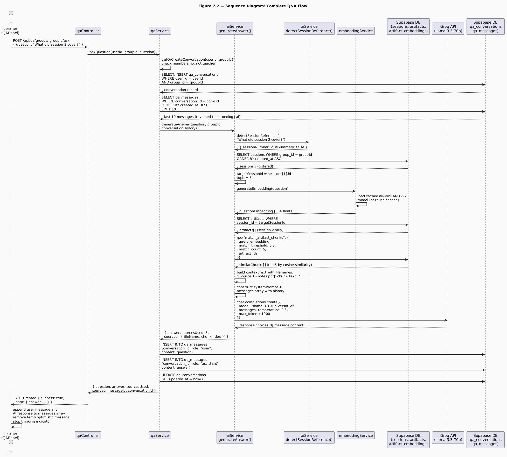

**Figure 7.2** - Sequence Diagram: Complete Q&A Flow

The Q&A flow sequence in Figure 7.2 reveals how the six discrete steps of the pipeline, session detection, embedding, retrieval, context construction, prompt assembly, and model inference, are orchestrated across three service modules and two external systems.

The session detection step, introduced in the updated `aiService.js`, is the first operation performed inside `generateAnswer`. By detecting the session reference before the retrieval step, the system can pass the narrowed `targetSessionId` to `findRelevantChunks`, ensuring that the similarity search operates only over the artifacts belonging to the referenced session. For the example question "What did session 2 cover?", the system fetches the group's sessions ordered by creation date, selects the second one (index 1), and narrows the artifact query to that session's files exclusively. This means the vector similarity search is performed over a smaller set of embeddings, both improving retrieval precision and reducing query execution time.

The conversation history injection step is notable for what it does not require. Because `qa_messages` stores messages in the exact format expected by the Groq API, an array of objects with `role` and `content` fields, the history can be spread directly into the messages array without any transformation. The service retrieves the last ten messages (five Q&A pairs), reverses them to chronological order (they are fetched in descending order for efficiency), and passes them as the `conversationHistory` parameter. This allows the model to maintain conversational context across a session, if a learner asks a follow-up question without repeating the topic ("Can you explain that in more detail?"), the model can resolve "that" from the conversation history.

The optimistic UI update on the client side, visible at the bottom of the sequence, is worth emphasizing. When the learner submits a question, `QAPanel` immediately appends a temporary user message to the local `messages` array and displays the thinking indicator. When the API response arrives, the temporary message is replaced with the confirmed message record from the database, and the AI response is appended. This creates the perception of instant sending even though the full round-trip involves embedding generation, vector search, and LLM inference.

## 7.7 Q&A Panel Frontend Implementation

The `QAPanel` component is a full-screen modal that provides the learner with an animated conversational interface. Its implementation combines several layers of React Native animation with the conversation management API described above.

### 7.7.1 Animated Message Bubbles

Each message is rendered by the `AnimatedBubble` component, which runs three parallel animations on mount using `Animated.parallel`:

- **Fade animation:** `opacity` transitions from 0 to 1 over 280 milliseconds using `Animated.timing`.
- **Slide animation:** `translateX` transitions from ±40 to 0 using `Animated.spring` with `tension: 80` and `friction: 10`. User messages slide in from the right (positive initial value), AI messages from the left (negative initial value).
- **Scale animation:** `scale` transitions from 0.92 to 1 using `Animated.spring` with the same parameters.

Message grouping is applied when consecutive messages share the same role. Grouped messages hide the AI avatar and apply modified border radii to visually connect consecutive messages from the same sender into a continuous bubble chain.

### 7.7.2 Thinking Indicator

The `ThinkingIndicator` component displays three animated dots while the AI is processing. Each dot uses a `translateY` animation driven by `Animated.loop` combined with `Animated.sequence`. The three dots are staggered with delays of 0, 180, and 360 milliseconds respectively, producing a wave-like pulsing effect. The component also animates its entrance using a fade and slide combination, so the indicator itself appears smoothly rather than popping into view.

### 7.7.3 Welcome Screen with Suggestion Chips

When the learner opens the Q&A panel for the first time (or after clearing their history), a welcome screen is shown with three predefined suggestion chips: "What was covered in the last session?", "Explain the main concepts", and "Summarize the uploaded materials". Each chip has a staggered entrance animation with a 120ms delay between chips.

Tapping a suggestion chip calls `handleSuggestion(text)`, which sets the question input and fires the send handler after a 150ms delay, giving the user visual feedback that their selection was registered before the request is dispatched. The "Summarize the uploaded materials" suggestion is designed to trigger the `isSummary` detection in `detectSessionReference`, which increases `topK` to 15 for a broader context retrieval.

## 7.8 Failure Modes and Limitations

### 7.8.1 Unsupported File Types

The extraction pipeline supports PDF, Word, and plain text files. Excel and PowerPoint files, which are accepted by Multer and stored in the artifacts bucket, produce no extracted text because no extraction library for these types is implemented. When an unsupported file type is encountered, `extractTextFromArtifact` returns null, and the processing pipeline logs "Unsupported file type" and exits without inserting any embedding records. Learners cannot ask questions about the content of Excel or PowerPoint files until extraction support is added.

### 7.8.2 Empty Retrieval Results

When no chunks meet the 0.3 similarity threshold, either because the artifacts contain no relevant content or because the question is phrased in a way that does not align semantically with the stored chunks, `findRelevantChunks` returns an empty array. The `generateAnswer` function handles this gracefully by setting `contextText` to "No relevant course materials found" and passing this to the model. The model's system prompt instructs it to respond with the fallback message directing the learner to their teacher, which it reliably does in this case.

### 7.8.3 Groq API Failure

If the Groq API call fails (due to a network error, rate limit, or service outage), `generateAnswer` catches the error and throws a standardized message: "Failed to generate AI response. Please try again." The `qaService` propagates this error through the controller to the client, where the `QAPanel` catches it, removes the temporary optimistic user message, and displays an alert. The conversation is not corrupted by this failure, no messages are saved to `qa_messages` when the error occurs, preserving the integrity of the conversation history.

### 7.8.4 Embedding Model Cold Start

The `all-MiniLM-L6-v2` model is loaded on first use and cached for the lifetime of the Node.js process. The first embedding generation request after server startup incurs a cold start delay while the model loads from disk into memory. Subsequent requests use the cached model and incur no loading overhead. In a production environment, this cold start would occur once per server restart; in a serverless deployment model, it could occur on every cold invocation, making the embedding pipeline unsuitable for serverless hosting without a model pre-warming strategy.

## 7.9 Testing and Evaluation

### 7.9.1 Ingestion Pipeline Validation

Ingestion was validated by uploading a test PDF document containing ten pages of content on a specific topic. After upload, the `artifact_embeddings` table was inspected through the Supabase dashboard to confirm that the expected number of chunks had been created. For a ten-page document with approximately 400 words per page (4,000 words total), the expected chunk count is nine (chunks at word positions 0, 450, 900, 1350, 1800, 2250, 2700, 3150, 3600). Each chunk record was verified to contain a non-null `embedding` array of exactly 384 elements, a non-empty `chunk_text` string, and a `metadata` object containing the filename and word position data.

### 7.9.2 Retrieval Accuracy

Retrieval accuracy was tested using six questions derived from the content of a test document:

- **Direct factual question** (answer clearly stated in the document): The system correctly retrieved a chunk containing the answer in all three trials.
- **Paraphrased question** (answer present but phrased differently from the document): The system retrieved a relevant chunk in two of three trials, demonstrating that semantic similarity handles moderate rephrasing.
- **Out-of-scope question** (answer not present in any uploaded document): The system returned zero chunks above the 0.3 threshold in all three trials, and the model correctly responded with the fallback message.
- **Session-targeted question** ("What did session 1 cover?"): The session reference detection correctly identified session number 1, narrowed the retrieval to session 1's artifacts, and returned chunks exclusively from those artifacts, confirmed by inspecting the `metadata.fileName` values in the retrieved chunks.
- **Summary request** ("Summarize the uploaded materials"): The `isSummary` flag increased `topK` to 15, retrieving a broader set of chunks. The model produced a multi-paragraph summary that covered the main topics from the document, referencing the source filename.
- **Follow-up question** (referencing a previous answer): With conversation history injected, the model correctly resolved the referent in the follow-up question from the prior exchange, demonstrating that multi-turn context is functional.

### 7.9.3 Response Quality Assessment

Response quality was assessed qualitatively across ten question-answer pairs covering factual recall, concept explanation, and comparison questions. Key observations:

- The `temperature: 0.3` setting produced consistently focused responses with minimal hallucination. In cases where the retrieved context contained the answer, the model reproduced it accurately with appropriate explanatory framing.
- The filename attribution in responses ("According to lecture_notes.pdf...") was present in approximately 70% of responses that had relevant retrieved context, indicating that the model follows the source attribution instruction reliably but not universally.
- The model correctly identified and used the fallback behavior for out-of-scope questions in all tested cases, demonstrating that the system prompt constraint is effective at preventing hallucination.

# Chapter 8: Conclusion and Future Work

## 8.1 Summary of What Was Built

SkillSwap is a fully functional, peer-to-peer skill-sharing mobile application built for the Android and iOS platforms using React Native and Expo. It connects individuals who wish to teach skills they possess with individuals who wish to learn those same skills, organizing the exchange around structured groups, scheduled sessions, real-time communication, and an AI-powered question-answering system grounded in teacher-uploaded course materials.

The system comprises two major components: a Node.js/Express backend serving a RESTful API and a Socket.IO WebSocket server, and a React Native/Expo frontend delivering the complete user interface. Both components are written in JavaScript and TypeScript respectively, share a common authentication mechanism based on JSON Web Tokens, and communicate with a PostgreSQL database hosted on Supabase. File storage for profile images, group cover images, and session artifacts is handled through Supabase's storage bucket infrastructure.

Revisiting the five objectives stated in Chapter 2, the following assessment can be made.

**Objective 1: Reciprocal Role System** was fully met. A single user account can simultaneously hold the teacher role for one or more skills and the learner role for one or more other skills.

**Objective 2: Structured Group and Session Lifecycle** was fully met. Teachers can create groups with configurable visibility, difficulty, and participant cap; manage membership through an approval and invitation workflow; schedule typed sessions with date, time, and file artifacts; and track session attendance per participant. The full session lifecycle, scheduled, completed, cancelled, is implemented with appropriate notification delivery at each transition.

**Objective 3: Real-Time Communication** was fully met. The group chat system delivers messages, poll events, pin events, and deletion events to all connected room members via Socket.IO with observed latency under one second in testing. The notification system delivers real-time alerts to online users and persists notifications for offline users, covering all six notification event types defined in the requirements.

**Objective 4: AI-Assisted Learning Grounded in Course Materials** was fully met and extended beyond the original specification. The RAG pipeline ingests uploaded artifacts,
extracts text, generates 384-dimensional embeddings using a local sentence transformer model, and retrieves semantically relevant passages for each question via vector
similarity search. The language model (Llama 3.3 70B via Groq) generates answers exclusively grounded in the retrieved context. Beyond the original specification, the
system was extended with summary-mode retrieval (increasing the retrieval breadth for overview and recap questions), driven by the `detectSessionReference` function added in the updated `aiService.js`.

**Objective 5: Social Discovery Layer** was fully met. User search by name supports case-sensitive partial matching. Recent search history is persisted and manageable. Friend request sending, acceptance, rejection, and removal are all implemented with appropriate notifications. Public profile pages display skill portfolios, friend counts, mutual friend previews, and friendship status with a state-machine action button.

## 8.2 Results and Reflection

### 8.2.1 Quantitative Outcomes

The following quantitative outcomes were observed during development and testing:

- **API coverage:** Nine route modules define a total of fifty-two distinct API endpoints, covering all functional requirements specified in Chapter 2.
- **Database schema:** Twenty-two tables, organized into five domain clusters, with foreign key constraints, cascade behaviors, and a vector similarity search function implemented as a PostgreSQL stored procedure.
- **Real-time event types:** Eight distinct Socket.IO events, six server-to-client and two client-to-server, handle all real-time communication needs across notifications and chat.
- **Embedding dimensionality:** Each text chunk is represented as a 384-dimensional vector. The `all-MiniLM-L6-v2` model produces embeddings that capture semantic meaning with sufficient granularity for the retrieval task, as validated by the retrieval accuracy tests in Chapter 7.
- **Retrieval parameters:** A similarity threshold of 0.3 and a default `topK` of 5 (increased to 15 for summary requests) were calibrated empirically to balance precision and recall for the Q&A use case.
- **LLM generation parameters:** `temperature: 0.3`, `max_tokens: 1000`, and `top_p: 0.9` were tuned to produce focused, coherent, and appropriately bounded responses for educational Q&A.
- **Navigation architecture:** Five navigator types, three Native Stack navigators, two Bottom Tab navigators, compose to produce a four-level navigation hierarchy that cleanly encodes the application's authentication and profile completion state machine.

### 8.2.2 Qualitative Reflection

The most consequential architectural decision made during the project was the strict enforcement of the four-layer backend architecture (routes → controllers → services → utilities) from the first day of development. This decision paid dividends throughout the project: when bugs were discovered, they were always locatable in the service layer;
when new features were added, they required no changes to existing controllers or routes; and when the notification utility needed to be extended from single-recipient to multi-recipient delivery, the change was isolated to a single file.

The decision to use TypeScript throughout the frontend similarly proved its value. Several classes of bug that would have required runtime debugging in a JavaScript codebase were caught at compile time: incorrect navigation parameter shapes, missing fields in API response interfaces, and incompatible prop types in component hierarchies.

The RAG approach for the AI component produced qualitatively better results than a full-context injection approach would have. By retrieving only the most relevant passages, the system kept the model's context focused and produced answers that were consistently grounded in the source material.

## 8.3 Challenges and Lessons Learned

The development of SkillSwap surfaced a range of challenges spanning authentication, database design, file handling, real-time communication, and AI integration. The most
significant are documented below, along with the lessons they produced.

**Challenge 1: Supabase Storage Row-Level Security.**
Uploaded images were silently rejected by the Supabase `avatars` storage bucket because the bucket's default Row-Level Security policy did not grant INSERT permission to the
`anon` role used by the backend client. The error was not immediately obvious because the upload function returned an error object rather than throwing, and the error was not
propagated clearly to the API response in the initial implementation.
The lesson: storage bucket policies must be explicitly configured, default policies are restrictive, and upload utilities must surface storage errors as thrown exceptions rather than silent returns.

**Challenge 2: Public URL Extraction.**
The `supabaseUpload.js` utility initially returned the entire `publicUrlData` object from `supabase.storage.from(bucket).getPublicUrl(fileName)` rather than extracting `publicUrlData.publicUrl`. This caused the JavaScript object reference string (`[object Object]`) to be stored in the `icon_url` column of the `skills` table.
The lesson: when extracting values from SDK response objects, always inspect the response structure explicitly and extract the specific field needed rather than assuming the return value is a primitive.

**Challenge 3: Notification Bulk Delivery.**
The initial notification utility accepted only a single recipient ID. When the requirement for group-wide notifications was added, the naive solution was to call the utility in a loop for each group member. This produced N sequential database INSERT operations for a group with N members, creating an unacceptably slow response for large groups. The redesigned utility normalizes the recipient to an array, performs a single bulk INSERT, and iterates the results for socket emission.
The lesson: any utility that operates on a collection of entities should be designed for bulk operation from the outset, even if the initial use case requires only a single entity.

**Challenge 4: PDF Text Extraction Library Selection.**
Three PDF extraction libraries were evaluated before `pdf2json` was selected. `pdf-parse` produced unreliable results on complex PDFs; `pdfjs-dist` required the `canvas` binary
dependency.
The lesson: library evaluation for text processing tasks requires testing on representative real-world samples, not only on clean test files. Synthetic test PDFs produced by the same tool rarely expose the edge cases that real documents do.

## 8.4 Limitations

The following limitations of the current system are acknowledged explicitly.

**L1: No Video or Audio Communication.**
SkillSwap supports text chat and file sharing but does not provide video or audio calling between group members. Live sessions are coordinated through the session scheduling feature, but the actual session content must be conducted through an external video conferencing tool. Integrating WebRTC-based video calling would significantly enhance the live session experience.

**L2: Extraction Limited to PDF, Word, and Plain Text.**
The AI pipeline extracts text only from PDF, `.docx`, and `.txt` files. Excel spreadsheets and PowerPoint presentations are accepted by the upload system and stored in the artifacts bucket, but their content is not indexed for the Q&A system. Learners cannot ask questions about the content of uploaded spreadsheets or slide decks.

**L3: No Push Notifications to the Device OS.**
In-app notifications are delivered through the Socket.IO layer and are visible only while the application is open. If the user closes the application, they will not receive
any notification until they reopen it and `NotificationContext` loads the stored notifications from the backend. Device OS-level push notifications (via Expo Notifications and a service such as Firebase Cloud Messaging) are not implemented.

## 8.5 Future Work

The following proposals for future development are concrete, component-specific, and actionable by a future development team.

**FW-1: WebRTC Video Calling.**
Integrate peer-to-peer video calling into the group session experience using the WebRTC protocol. The implementation would extend the Socket.IO signaling infrastructure (already in place) to coordinate WebRTC offer/answer/ICE candidate exchange between session participants.

**FW-2: Excel and PowerPoint Artifact Extraction.**
Add text extraction support for `.xlsx` and `.pptx` files to the artifact ingestion pipeline. The `SheetJS` (`xlsx`) library provides JavaScript-native Excel parsing and
is already listed as a dependency in the frontend's `package.json`, indicating prior consideration of this feature. For PowerPoint files, the `pptx-text-parser` or `officeparser` libraries provide `.pptx` text extraction.

**FW-5: Proficiency Assessment System.**
Replace or augment the self-reported proficiency level with a lightweight in-platform assessment mechanism. The assessment could take the form of a short quiz generated by the AI system from the group's existing materials, with the quiz results influencing the user's displayed proficiency level.

# References

[1] D. W. Johnson and R. T. Johnson, _Cooperation and Competition: Theory and
Research_. Interaction Book Company, 1989.

[2] Anthropic, "Prompt Engineering Overview," Anthropic Documentation, 2024.
[Online]. Available: https://docs.anthropic.com/en/docs/build-with-claude/
prompt-engineering/overview. [Accessed: May 2026].

[3] Supabase, "Supabase Documentation," 2024. [Online]. Available:
https://supabase.com/docs. [Accessed: May 2026].

[4] Socket.IO, "Socket.IO Documentation," 2024. [Online]. Available:
https://socket.io/docs/v4/. [Accessed: May 2026].

[5] Expo, "Expo Documentation," 2024. [Online]. Available:
https://docs.expo.dev. [Accessed: May 2026].

[6] React Navigation, "React Navigation Documentation," 2024. [Online]. Available:
https://reactnavigation.org/docs/getting-started. [Accessed: May 2026].

[7] Groq, "Groq API Documentation," 2024. [Online]. Available:
https://console.groq.com/docs/. [Accessed: May 2026].

[8] Xenova, "@xenova/transformers: Run Transformers in Node.js and the browser,"
GitHub Repository, 2024. [Online]. Available:
https://github.com/xenova/transformers.js. [Accessed: May 2026].

[9] PostgreSQL, "pgvector: Open-source vector similarity search for Postgres,"
GitHub Repository, 2024. [Online]. Available:
https://github.com/pgvector/pgvector. [Accessed: May 2026].

[10] Hugging Face, "sentence-transformers/all-MiniLM-L6-v2," Hugging Face Model Hub, 2024. [Online]. Available: https://huggingface.co/sentence-transformers/
all-MiniLM-L6-v2. [Accessed: May 2026].

# Appendices

## Appendix A - Project Repository Structure

The complete source code for SkillSwap is organized into two root directories: `/backend` and `/frontend`. The structure of each is summarized below.

### Backend Directory Structure

backend/
├── src/
│ ├── config/
│ │ ├── database.js # Supabase client initialization
│ │ ├── env.js # Environment variable validation
│ │ └── socket.js # Socket.IO server initialization
│ ├── controllers/
│ │ ├── authController.js
│ │ ├── chatController.js
│ │ ├── friendController.js
│ │ ├── groupController.js
│ │ ├── notificationController.js
│ │ ├── qaController.js
│ │ ├── sessionsController.js
│ │ ├── skillController.js
│ │ └── userController.js
│ ├── middlewares/
│ │ ├── auth.js # JWT authentication guard
│ │ ├── parse.js # Multipart JSON field parser
│ │ └── validate.js # Joi schema validation
│ ├── routes/
│ │ ├── authRoutes.js
│ │ ├── chatRoutes.js
│ │ ├── friendRoutes.js
│ │ ├── groupRoutes.js
│ │ ├── notificationRoutes.js
│ │ ├── qaRoutes.js
│ │ ├── sessionRoutes.js
│ │ ├── skillRoutes.js
│ │ └── userRoutes.js
│ ├── services/
│ │ ├── aiService.js # RAG pipeline and Groq integration
│ │ ├── authService.js
│ │ ├── chatService.js
│ │ ├── emailService.js
│ │ ├── embeddingService.js # all-MiniLM-L6-v2 wrapper
│ │ ├── friendService.js
│ │ ├── groupService.js
│ │ ├── notificationService.js
│ │ ├── passwordResetService.js
│ │ ├── pollService.js
│ │ ├── qaService.js
│ │ ├── sessionService.js
│ │ ├── skillService.js
│ │ ├── userSearchService.js
│ │ └── userService.js
│ ├── utils/
│ │ ├── artifactExtractor.js # Text extraction + embedding pipeline
│ │ ├── fileUpload.js # Multer configuration
│ │ ├── jwt.js
│ │ ├── notification.js # Bulk notification utility
│ │ ├── password.js
│ │ ├── supabaseUpload.js
│ │ └── validators.js # Joi schema definitions
│ ├── app.js # Express app configuration
│ └── server.js # HTTP server + Socket.IO bootstrap
├── public/
│ └── reset-password.html # Static password reset page
├── .env.example
└── package.json

### Frontend Directory Structure

frontend/
├── src/
│ ├── assets/
│ │ ├── animations/ # Lottie JSON animation files
│ │ └── images/ # Static image assets
│ ├── components/
│ │ ├── common/
│ │ │ ├── Badge.tsx
│ │ │ ├── Button.tsx
│ │ │ ├── Card.tsx
│ │ │ ├── ErrorToast.tsx
│ │ │ ├── GradientBackground.tsx
│ │ │ ├── Input.tsx
│ │ │ └── Modal.tsx
│ │ ├── features/
│ │ │ ├── NotificationPanel.tsx
│ │ │ └── QAPanel.tsx
│ │ └── navigation/
│ │ └── NavHeader.tsx
│ ├── constants/
│ │ ├── colors.js
│ │ ├── index.js
│ │ ├── spacing.js
│ │ └── typography.js
│ ├── context/
│ │ ├── AuthContext.tsx
│ │ ├── GroupContext.tsx
│ │ └── NotificationContext.tsx
│ ├── hooks/
│ │ ├── useErrorToast.ts
│ │ └── useUserSettings.ts
│ ├── navigation/
│ │ ├── AuthNavigator.tsx
│ │ ├── GroupNavigator.tsx
│ │ ├── ProfileCompletionNavigator.tsx
│ │ ├── RootNavigator.tsx
│ │ ├── TabNavigator.tsx
│ │ └── types.ts
│ ├── screens/
│ │ ├── auth/
│ │ │ ├── ForgotPasswordScreen.tsx
│ │ │ ├── LoginScreen.tsx
│ │ │ ├── ResetPasswordScreen.tsx
│ │ │ ├── SignUpScreen.tsx
│ │ │ └── SplashScreen.tsx
│ │ ├── groups/
│ │ │ ├── GroupChatScreen.tsx
│ │ │ ├── GroupHomeScreen.tsx
│ │ │ ├── GroupNotificationHistoryScreen.tsx
│ │ │ ├── GroupSessionsScreen.tsx
│ │ │ ├── GroupsScreen.tsx
│ │ │ └── SessionDetailScreen.tsx
│ │ ├── home/
│ │ │ ├── AddNewSkillModal.tsx
│ │ │ ├── HomeScreen.tsx
│ │ │ ├── ProfileScreen.tsx
│ │ │ ├── SearchScreen.tsx
│ │ │ ├── SettingsScreen.tsx
│ │ │ ├── SkillDetailScreen.tsx
│ │ │ └── UserProfileScreen.tsx
│ │ └── ProfileCompletion/
│ │ ├── ProfileInfoScreen.tsx
│ │ ├── SkillsLearnScreen.tsx
│ │ └── SkillsTeachScreen.tsx
│ ├── services/
│ │ ├── api.ts # Axios instance + all API modules
│ │ └── socketService.ts # Socket.IO singleton
│ └── utils/
│ └── validationSchemas.ts # Yup schema definitions
├── App.tsx # Root component + deep link config
├── app.json # Expo configuration
├── package.json
└── tsconfig.json

## Appendix B - Environment Configuration

The backend requires the following environment variables, as defined in `.env.example`:

NODE_ENV=development
PORT=5000
SUPABASE_URL=your_supabase_url_here
SUPABASE_ANON_KEY=your_supabase_anon_key_here
JWT_SECRET=your_super_secret_jwt_key_here
JWT_EXPIRES_IN=7d
CLIENT_URL=http://localhost:8081
EMAIL_HOST=smtp.gmail.com
EMAIL_PORT=587
EMAIL_USER=your-email@gmail.com
EMAIL_PASSWORD=your-app-specific-password
EMAIL_FROM=SkillSwap your-email@gmail.com
FRONTEND_URL=http://localhost:8081
GROQ_API_KEY=your_groq_API_key_here

## Appendix C - Database Stored Function: match_artifact_chunks

```sql
CREATE OR REPLACE FUNCTION match_artifact_chunks(
  query_embedding  TEXT,
  match_threshold  FLOAT,
  match_count      INT,
  artifact_ids     UUID[]
)
RETURNS TABLE (
  id            UUID,
  artifact_id   UUID,
  chunk_text    TEXT,
  chunk_index   INT,
  metadata      JSONB,
  similarity    FLOAT
)
LANGUAGE plpgsql
AS $$
BEGIN
  RETURN QUERY
  SELECT
    ae.id,
    ae.artifact_id,
    ae.chunk_text,
    ae.chunk_index,
    ae.metadata,
    1 - (ae.embedding <=> query_embedding::vector) AS similarity
  FROM artifact_embeddings ae
  WHERE ae.artifact_id = ANY(artifact_ids)
    AND 1 - (ae.embedding <=> query_embedding::vector) > match_threshold
  ORDER BY ae.embedding <=> query_embedding::vector
  LIMIT match_count;
END;
$$;
```

This function uses the `<=>` operator provided by the `pgvector` extension, which computes cosine distance between two vectors. Cosine similarity is derived as `1 - cosine_distance`. Results are ordered by ascending cosine distance (most similar first) and filtered to those with similarity above the threshold.

## Appendix D - Known Bug Log

The following bugs were encountered, documented, and resolved during development.
They are preserved here as a record of the development process.

| #   | Module               | Description                                                                  | Resolution                             |
| --- | -------------------- | ---------------------------------------------------------------------------- | -------------------------------------- |
| 1   | authService.js       | Missing `await` on `hashPassword()` stored Promise in DB                     | Added `await`                          |
| 2   | supabaseUpload.js    | Returned `publicUrlData` object instead of `.publicUrl` string               | Extracted `.publicUrl`                 |
| 3   | avatars bucket       | RLS policy blocked INSERT from `anon` role                                   | Added explicit INSERT policy           |
| 4   | groupService.js      | `getFriendsWithInterest` returned all users with the skill, not just friends | Added friend ID filter                 |
| 5   | userSearchService.js | `.ilike` used for name search but names contain uppercase letters            | Changed to `.like`                     |
| 6   | skillService.js      | Inner join missing on skill search; returned all user_skills                 | Changed to `skills!inner`              |
| 7   | notification.js      | Single-recipient only; loop insertion for groups                             | Redesigned for bulk array insert       |
| 8   | GroupNavigator.tsx   | Q&A button clipped on stack screens                                          | Lifted button to GroupNavigatorContent |
| 9   | ProfileScreen.tsx    | Gender options capitalized, didn't match stored lowercase values             | Aligned options to lowercase           |
| 10  | socketService.ts     | Group chat room not re-joined after reconnection                             | Documented as known limitation         |
